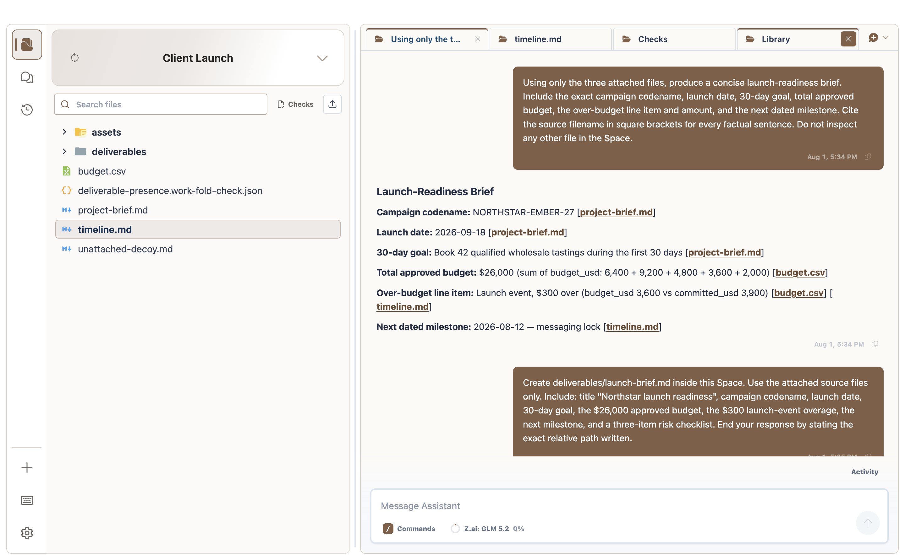
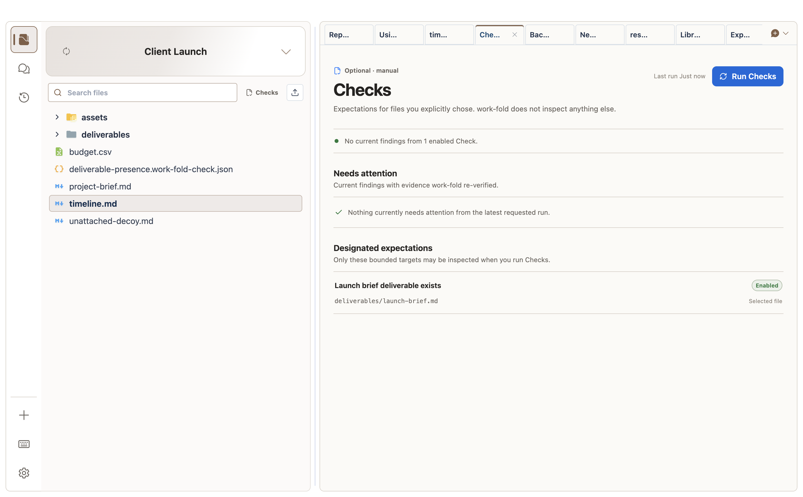
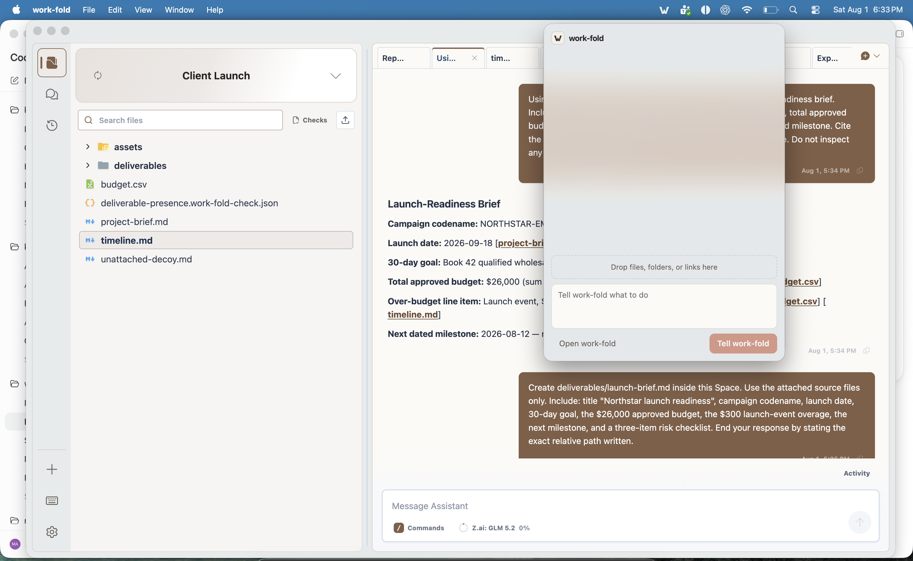

# work-fold

<p align="center">
  <picture>
    <source media="(prefers-color-scheme: dark)" srcset="desktop/assets/brand/lockup-horizontal-white.png" />
    
  </picture>
</p>

[](https://github.com/Mat-Tom-Son/work-fold/actions/workflows/ci.yml)
[](https://github.com/Mat-Tom-Son/work-fold-mac-releases/releases/latest)
[](LICENSE)

work-fold is a local-first Electron app that gives every kind of computer work a place, with a native [Pi](https://pi.dev) assistant built in.

In the product, that place is called a **Space**: an understandable working context backed by an ordinary folder. A person can create a new Space and let work-fold create its folder, or turn an existing folder on their computer into a Space without moving or converting its files. Each Space keeps its portable identity and Chats in a hidden `.work-fold/` directory. Executable project capabilities remain separate under `.pi/`; provider credentials, trust, History objects, sessions, ignore rules, and app preferences stay in protected application or Pi storage outside the Space.

The core idea is simple: the folder stays ordinary; work-fold makes it feel like a place you can understand, return to, and work in with an Assistant.

## Get work-fold

[Download work-fold for Apple silicon Macs](https://github.com/Mat-Tom-Son/work-fold-mac-releases/releases/latest). The Mac app updates from that public feed; both the app and DMG are Developer ID-signed, notarized, and accepted by Gatekeeper. The public Windows build is deliberately deferred until it can be signed with a valid Authenticode identity—work-fold does not present a self-signed installer as publicly trusted.

work-fold is a clean product boundary, not an in-place rename of Workspace. It uses a new application profile, updater identity, CLI, repository, release feed, internal protocol, and `.work-fold/` Space metadata. It never imports, migrates, rewrites, wipes, or deletes legacy Workspace state or `.workspace/` content; those bytes remain preserved and inert. The old `Mat-Tom-Son/workspace` and `Mat-Tom-Son/workspace-mac-releases` repositories are frozen legacy surfaces and never receive work-fold releases.

## A quick walkthrough

Choose an ordinary folder—or let work-fold create one—and it becomes a Space.
The files stay where they are. In this launch-planning Space, the Assistant used
only the three attached source files, returned a brief with links back to the
evidence, and kept the work beside its source material.



Checks are optional, manual expectations over files you explicitly designate.
Here work-fold re-verifies that the generated launch brief exists without
inspecting unrelated files in the Space.



On a Mac, the fold also lives in the menu bar. The example below is the real
completed request with the main window closed: work-fold copied an attached
handoff into the Client Launch Space and recorded a restore point. Click the
fold—or drop files, folders, or links on it—from anywhere to start another
request.



## Product model

| Concept | What it means |
|---|---|
| **work-fold** | The product: an environment for general computer work. |
| **Space** | Everything associated with one activity, backed by an ordinary folder. |
| **Files** | The ordinary folder contents of the selected Space. |
| **Library** | Reusable personal materials that can be brought into any Space. |
| **Assistant tools** | A Space-owned work tab for discovering and managing what the Assistant can do. |
| **Skill** | A reusable way of working that guides the Assistant. |
| **Extension** | A capability or connection the Assistant can use. |
| **App Project** | An optional, machine-local build and publication identity declared for one Space. |
| **Feature** | One reviewed restricted-app contribution built in an App Project. |
| **Release** | An immutable, content-addressed snapshot of an App Project's reviewed Features and presentation. |
| **App Instance** | One Release installed into a chosen Space with its own data and authority. |

The Space-identity header menu selects the root-folder entity a person is working in and offers compact actions to use an existing folder, create a new Space, or manage Spaces. The primary navigation then opens surfaces for that selected Space and the surrounding product:

- **Files**
- **Chats**
- **History**

The bottom-rail **Add** menu opens one persistent Library tab for the selected Space, Assistant-tool discovery and management, or app building without adding occasional destinations to the primary rail. Every Space may own one Library tab, and all of those tabs read the same passive personal collection. The owning Space is the default copy target, and a destination selector can send an independent copy to any registered Space. Provider, model, API-key, and provider OAuth setup—when a provider flow is supported—lives under **Settings → Assistant**. Connections used by a restricted Space app are configured separately with that app in **Assistant tools**.

The folder is an implementation detail, but never a proprietary boundary. Space files remain ordinary files that can be opened in other apps, synchronized by desktop storage tools, backed up, or revealed in the operating system.

work-fold reserves two hidden support directories inside a Space: `.work-fold/` for the portable `space.json` identity and append-only conversation logs, and `.pi/` for native Pi project configuration. Neither appears in the Files surface or History checkpoints. Removing a linked Space from the app leaves `.work-fold/` with the folder; deleting a managed Space deletes its folder normally.

## What it supports

- Creating a new Space or turning an existing local folder into a Space, including folders synchronized by tools such as Google Drive for desktop.
- Searching a Space by file contents and Chat transcripts as well as by name, within bounds that are disclosed when they are reached.
- Space file browsing, uploads, previews, chat attachments, and ordinary-folder access.
- A personal Library for organizing reusable files and copying them into Spaces when needed.
- Pi's normal built-in tools, provider/model selection, API-key and supported provider OAuth authentication, prompt templates, context files, and packages.
- Chat composer discovery for installed Skills, prompts, Extension commands, and supported built-ins, plus active-model and context-window visibility.
- Active, snoozed, and archived Chat views with automatic resurfacing, undoable lifecycle actions, read-only deferred transcripts, quiet running/finished indicators for background work, and collapsed groups for Chats in other Spaces.
- Per-Space identity customization with curated one-click Looks, semantic light/dark colour roles, paired banner colours, safe images, searchable Fluent icons, dual previews, contrast auditing, undo/reset, and code-free proposal import/export.
- One Space-owned Assistant tools work tab for installed Skills and Extensions, official/reference sources, community Pi packages, provenance, scope, diagnostics, update, and removal, opened on demand from Add, the command palette, or the desktop shortcut.
- Global and registered-Space Pi Extensions. Native Pi Extensions run with the current user's permissions.
- Validated declarative Extension surfaces that can contribute an app rail destination, navigator pane, and Space-bound data views without injecting Extension code into the renderer.
- A [full-trust Connected inbox Pi Extension example](examples/packages/connected-inbox/README.md) and a separate, runnable [restricted Connected inbox Space app](examples/packages/restricted-connected-inbox/README.md).
- A separate restricted-app lane: strict non-evaluating review, content-addressed Development previews, arbitrary reviewed web UI in a sandboxed Space rail navigator, app-requested persistent Space-owned tabs, optional Assistant-action and automation workers, a shared machine-wide scheduler for named jobs, durable run receipts, bounded local app storage with active-view invalidation hints, reviewed History-covered Space-file grants, explicit public-HTTPS or loopback access, host-owned encrypted credentials, standards-only OAuth PKCE, and static reviewed system notifications from enabled automations.
- A local App Studio that declares a machine-local App Project, prepares immutable version-2 Releases from reviewed previews, publishes them as a separate local decision, installs a published Release into a chosen registered Space, and prepares deterministic updates or rollbacks before activation.
- [Agent Skills](https://agentskills.io) from standard `SKILL.md` directories, `.skill`/ZIP bundles, and skill-only imports from compatible multi-skill packs.
- Assisted Windows installation and a signed/notarized Apple silicon DMG, with GitHub-hosted application updates on both platforms.
- A versioned management layer and installed `work-fold` command: a content-free read lane for inspecting Space context, running work, and Pi capabilities, plus a per-launch-authenticated act lane that gives a shell-capable agent the product's receipted verbs while the app is running — Space lifecycle and appearance, Chats and their lifecycle, History saves and restores, restore-pointed file operations, Library copies, content search, Checks, and App Studio's authority-neutral lifecycle — every action journaled before it runs, replays refused by request id, and acts that install code, widen a power, or destroy something staged for a human decision instead of executed.
- The fold — a management conversation above all Spaces (`work-fold manage …`): the same full-trust Assistant runtime with a machine-local transcript, taught by app-materialized instructions to work across Spaces through the work-fold CLI's read and act commands. Requests carry reference attachments (`--attach` paths and links), track every delegated Space turn, and support request-level status and stop.
- A menu-bar popover that opens your fold ("Your fold" in the menu bar and tray): drop files, folders, or links on the macOS menu-bar icon or the popover, add an instruction — with material staged, the send button reads "Fold it in" — and follow the request through working, needs-you, handed-off, and done, with an explicitly attributed action trail backed by act receipts and a Stop that names everything it aborts. New chat starts a clean saved transcript without deleting the previous one. The Windows tray offers the same popover from its menu.
- Needs-you decisions: the fold can fully stage installing code, widening a standing power, or destroying something — and only a click on the desktop, the popover, or an approved browser completes it. Cards are host-composed from pinned facts, staged acts expire, denial is recorded rather than retried, and every decision leaves a receipt naming the surface that approved it. Narrow person-authored standing policies, created in Settings and never by the fold, can pre-approve exactly named categories — never destruction or outward exposure.
- The glance: a deterministic digest of running work, needs-you items, what changed since you last looked, and Check status — composed by app code from recorded state only, with no model call, no file scanning, and no background watching, shown at the popover's top, the remote client's home, and a compact main-window panel.
- Routings: declared cross-Space glue — a reviewed trigger and up to eight deterministic steps (start a Space chat with a fixed message, copy files with a restore point, run a Check), executed by app code on the shared scheduler discipline with per-hop receipts. Enabling one is a needs-you decision; cross-Space work never runs inside a Space chat, because Space transcripts travel with their folders.
- Private-alpha web access to your fold ("Your fold on the web") at a chosen `<name>.work-fold.com`: set the address and password in Settings, approve each new browser with a matching code on the desktop, then open saved management Chats, browse filtered Space-relative file trees, and ask the one management Assistant to work across Spaces or delegate to their Assistants. Files selection never changes who the person is chatting with. Bounded encrypted uploads use short-lived app-owned staging until the management Assistant uses or places them through the normal restore-pointed path. New-address enrollment is controlled by the hosted bridge instead of an invitation code or a credential embedded in the app. Payloads cross the hosted service as application-encrypted signed envelopes rather than durable plaintext records, but the hosted client and bridge are trusted parts of this full-authority feature and an active service compromise is outside that protection. The desktop must be online and remains the local execution endpoint.
- Share a page ("pages your fold serves"): after a needs-you decision, one explicitly designated file is served as a rendered page at your `<name>.work-fold.com` address — live from your desktop through the relay, encrypted with a key carried in the link fragment, with an honest "asleep" state when the desktop is offline. Revoking kills every copy of the link; nothing else in the Space is exposed; there is no uptime promise, discovery, or App Store.
- Native OS file drops on any Chat composer: dropped files upload into that Space's dated `Dropped/` folder and attach as explicit chat context.

work-fold does not bundle organization-specific tools, instructions, document libraries, or cloud accounts.

Current desktop boundaries: Google Drive works through a Drive-for-desktop folder rather than native cloud mirroring. Settings offers API-key setup and Pi's OAuth flow for providers that advertise one, but account-tier, billing, and packaged-flow support remain provider-specific claims that require release verification. Direct Drive API sync is intentionally left for a later provider-adapter release. Restricted apps have a separate, app-scoped OAuth PKCE connection lane for providers that publish compatible public-client metadata.

For the durable design rationale, context rules, and roadmap, see [Product model and roadmap](docs/product-model.md). For the shared control plane, CLI, and real-agent driver, see [work-fold management layer](docs/management-layer.md). For scopes, trust, Skill packs, Extensions, and packages, see [Assistant capabilities](docs/assistant-capabilities.md). The [desktop experience parity contract](docs/ui-parity.md) records the mature interactions this extraction must preserve, while the [visual system](docs/visual-design.md) defines the restrained shell, typography, icon, and layout rules.

## Restricted Space apps

work-fold's restricted-app lane lets an Assistant build an interactive app for one Space without turning generated code into a full-trust Pi Extension. The app can own a navigator destination in the contributed rail, open and restore persistent right-side work tabs, expose bounded Assistant actions, keep machine-local JSON state, call explicitly reviewed network targets, work inside a separately selected Space file or folder, and declare independently controlled named automations coordinated by one scheduler across every Space.

The normal creation path begins in a Space Chat:

1. The Assistant writes a complete, already-built package inside the Space and calls the host-owned `propose_space_app` tool with only its Space-relative folder.
2. work-fold inspects the package without evaluating JavaScript and returns a digest-pinned review to that owning Chat.
3. The person chooses whether to add that exact revision as a **Local preview** in the source Space's Development Instance. Adding it grants only bounded app storage; network destinations, files, notification categories, saved connections, and every automation remain off.
4. **Assistant tools → Installed → Apps in this Space** manages each authority separately. The app itself opens from the contributed rail and may create normal Space-owned tabs in the work area.

Revoking a destination stops brokered requests but does not silently delete a saved credential; **Disconnect** removes the machine-local encrypted record. Provider-side token or API-key revocation remains the provider's responsibility. Updating a Development preview preserves its explicit data lineage but resets grants, connections, notification access, and automation settings so a new revision cannot inherit old powers. Predecessor run receipts remain durable audit lineage even though the current-revision run view starts empty.

When a preview is ready to become an installable App, **App Studio** provides the local release lifecycle:

1. Declare or edit the App Project's title, description, and icon. This presentation and the Project identity are machine-local; work-fold does not add another portable file to the Space.
2. Prepare a Release from every currently reviewed Development preview. The immutable v2 envelope includes the exact Feature bytes, declarations, presentation, dependency inventory, provenance, and inspection evidence in a content-addressed local store.
3. Review and separately publish that prepared Release. Publishing is a local state transition, not an upload, hosted deployment, signature, or App Store submission, and fails if a source preview changed after preparation.
4. Prepare and activate installation into a chosen registered Space. The App Instance is distinct from its Development Instance, starts every destination, file, notification, connection, and automation off, and keeps its executable bytes, data, grants, operation journal, and receipts in work-fold application data.
5. Prepare an update or rollback to another published Release, inspect its continuity/reset plan, then activate it. Exact unchanged Feature content may keep eligible authority; changed content resets grants, connections, and jobs while preserving the Feature installation and data namespace. Schema-bearing Releases and migration execution are rejected by the current local runtime.
6. Uninstall the whole App Instance with an explicit **retain data** or **purge data** choice. Retained namespaces are no longer runnable and can be purged later from App Studio.
7. Delete an unused prepared or published Release to reclaim its local immutable object. work-fold blocks deletion while an active Instance, either side of a prepared operation, or retained data still needs that Release. The Release store has a four-GiB aggregate quota.

The current local lane allows one App Instance per `(App Project, target Space)`. A target Space cannot already contain a preview or installed Feature with the same Feature id. The source Space and every target Space stay ordinary folders; work-fold blocks removing either registration while an active release-backed instance still depends on it and directs the person to uninstall first. Retained App data continues to block the source until explicit purge, but no longer binds the former target. Removing an obligation-free source clears its machine-local App Project and Release lineage; removing a target cancels prepared operations aimed there.

Start with [Restricted app authoring](docs/restricted-app-authoring.md) to build a package, [Restricted app runtime](docs/restricted-app-runtime.md) for the security and lifecycle contract, and the [Connected inbox example](examples/packages/restricted-connected-inbox/README.md) for a runnable rail, tab, loopback service, storage, automation, and notification walkthrough.

The App-platform foundation is now a shipped local product layer: a Space may
carry an optional App Project and Development Instance; App Studio prepares and
publishes immutable Releases, installs release-backed App Instances in chosen
Spaces, and persists install/update preparation before activation. Install,
update, rollback, uninstall, retention, and later purge use explicit, separately
receipted lifecycle acts. Local App bytes, data, authority, and project
presentation remain on this computer and outside ordinary Space folders.
The checked-in private-hosted semantic core proves a narrow matching slice—role
separation, immutable publication/deployment, instance-owned connection and
leased job authority, compatible update, role-aware data, export, deletion, and
restart recovery—with durable adapter interfaces and a non-coding
community-garden fixture. It does not yet cover the full portable runtime and is
not a deployed cloud service, sync path, upload service, or App Store. See the
[App platform foundation](docs/app-platform-foundation.md) for the exact local
and future-hosted boundaries.

## Management layer

`WorkFoldKernel` is the shared in-process read authority for the product. It resolves an actor to a Space, returns versioned Space and running-task snapshots, and projects Pi's authoritative capability catalog with scope, provenance, trust, package, and diagnostic information. The renderer/local API and the installed CLI use that same kernel instance; writes still go through the domain services that own trust, filesystem, History, and concurrency policy.

This is the first management primitive for a future cross-Space Assistant and controlled Space runtimes, not a hidden mutation API. Protocol v1 is deliberately read-only and exposes no file contents, conversation text, credentials, or provider tokens. See [work-fold management layer](docs/management-layer.md) for the architecture, transport, security boundary, code map, and roadmap.

## Development

Use Node 22.19.0 or newer.

```bash
npm install
npm run local:dev
```

The official Railway CLI can be installed into the ignored repo-local `.tools/`
directory. The installer verifies the release asset against the SHA-256 digest
published by Railway's GitHub release. The wrapper reads local authentication
from the ignored `.env.railway.local` file, and `railway link` metadata under
`.railway/` is also ignored as machine-specific state:

```bash
npm run railway:install
npm run railway -- --version
npm run railway -- whoami
npm run railway -- link
```

Use exactly one credential in `.env.railway.local`: `RAILWAY_TOKEN` for a
project-scoped token or `RAILWAY_API_TOKEN` for an account/workspace token. The
private remote bridge lives in `services/bridge`; its own README documents the
PostgreSQL, enrollment, one-replica, Railway, and wildcard-domain contract.
Railway credentials remain ignored local or platform configuration and must
never be committed.

Useful checks:

```bash
npm run check
npm test
npm run desktop:prepare
npm run desktop:package:smoke
npm run desktop:make
npm run desktop:make:mac
npm run desktop:rc:mac
```

`desktop:package:smoke` creates and verifies the canonical Windows Electron Builder unpacked app while skipping NSIS installer and updater-artifact creation. The slower `desktop:package` command retains a Forge package lane for targeted diagnostics. `desktop:make` builds the Windows NSIS candidate; `desktop:make:mac` builds the non-interactive, separately identified `work-fold Local Smoke` artifacts; `desktop:rc:mac` creates an app-only signed/notarized Mac candidate for interactive QA; and `desktop:release:mac` signs, notarizes, verifies, and publishes the complete production Mac artifacts. Interrupted full Mac builds can be inspected with `desktop:release:mac:status` and resumed only while their source-bound artifact checkpoint validates.

Use `npm run local:dev` for the fast UI loop, `check` and `test` for normal implementation feedback, and `desktop:prepare` for desktop integration. See [Windows builds](docs/windows-build.md) and [macOS builds](docs/macos-build.md) for platform packaging and release gates.

`npm run local:api`, `npm run local:dev`, non-packaged Electron runs, and Windows package directories that have not been installed keep development data in a dedicated platform application-data directory by default (`%APPDATA%\work-fold Development` on Windows, `~/Library/Application Support/work-fold Development` on macOS, or the corresponding XDG configuration directory on Linux). This includes both feed-less smoke output and the feed-bearing `win-unpacked` release candidate: only an NSIS-installed Windows app with its installer-owned uninstaller selects the installed product's `work-fold` state. Set `WORKFOLD_STATE_DIR` for the local API or `WORKFOLD_DESKTOP_STATE_DIR` for Electron only when you intentionally want a specific disposable state tree. `WORKFOLD_CLI_STATE_DIR` is the separate exact broker root used by packaged CLI shims and is propagated only to child commands.

CI runs `check`, `test`, and `desktop:package:smoke`, so every branch verifies the same unpacked Electron Builder layout used by the release lane without paying the NSIS cost.

### Developing with Codex or Claude Code

The repository has one contributor contract: [AGENTS.md](AGENTS.md). Codex reads it directly. The tracked [CLAUDE.md](CLAUDE.md) uses Claude Code's `@AGENTS.md` import so both harnesses receive the same product rails, commands, test expectations, release rules, and Pi Skill/Extension/tool boundaries without duplicated prose. Product tools remain the same native Pi catalog regardless of which development harness edits the repository.

The standard project Skill [Ship macOS Release](.agents/skills/ship-macos-release/SKILL.md) routes agents through the same documented candidate, checkpoint, recovery, verification, and publication lanes; it does not define a harness-specific release path.

Both harnesses can author and audit the exact same inert Space-appearance proposal:

```bash
npm run --silent work-fold:appearance -- create --name "Client work" --color "#0d74ce" --icon briefcase --banner aurora --created-by codex --out client-work.work-fold.json
npm run --silent work-fold:appearance -- validate client-work.work-fold.json --json
```

Use `--created-by claude-code` in Claude Code. The command never applies a mutation; import the
proposal in Customize Space after reviewing the light/dark preview. See
[Space customization](docs/space-customization.md).

They can also author the same inert Check proposal without enabling or running it:

```bash
npm run --silent work-fold:checks -- create-file-presence --title "Signed delivery exists" --file "Delivery/signed.pdf" --expect present --created-by codex --out signed-delivery.work-fold-check.json
npm run --silent work-fold:checks -- validate signed-delivery.work-fold-check.json --json
```

The proposal is ordinary reviewable JSON. Enablement remains a separate authenticated `work-fold checks enable --space ... --proposal ...` act while the app is running.

To exercise one real Assistant turn through the same local API, Pi runtime, tools, Skills, Extensions, persistence, and event stream as the desktop app:

```powershell
npm run work-fold:drive -- --space-root C:\path\to\space --prompt "Summarize this Space"
npm run work-fold:drive -- --space-root C:\path\to\space --prompt "..." --json --agent-dir C:\temp\isolated-pi
```

In-process driver runs use temporary application state unless `WORKFOLD_STATE_DIR` is set. Use `--attach http://127.0.0.1:4327` to drive an already-running development API. This driver performs a real agent turn; it is distinct from the read-only installed management CLI below.

## work-fold CLI

The Windows installer includes a `work-fold` command and adds its package-root `bin` directory to the current user's `PATH`. The Mac app carries the same command under `work-fold.app/Contents/bin`; work-fold adds that directory to child processes so Pi shell tools can use it. A DMG does not silently edit shell profiles, so exposing the command to unrelated Terminal sessions remains an explicit installation action.

The command uses a bounded protocol-v1 handoff under the owning app's platform application-data directory. Installed production apps use `%APPDATA%\work-fold\cli` on Windows and `~/Library/Application Support/work-fold/cli` on macOS; uninstalled Windows packages use `%APPDATA%\work-fold Development\cli`, and the separately identified Mac smoke app uses its own directory. It writes one atomic request, starts or contacts the packaged app, returns stdout, stderr, and the exit code, and removes the response. Platform helpers remain outside `app.asar`, Electron's `RunAsNode` fuse stays disabled, and the CLI-only state root cannot opt another desktop process into the parent's data.

```powershell
work-fold context --json
work-fold spaces list
work-fold tasks list --space "Personal Space"
work-fold capabilities list --space "Personal Space" --json
work-fold chat send --space "Home" --new --message "File the material I dropped."
work-fold chat wait --space "Home" --task <task-id> --json
work-fold files add --space "Vendor Audits" --from ./report.pdf --to "Inbox"
work-fold manage send --message "What changed across my Spaces today?"
work-fold manage send --message "Put this where it belongs." --attach ./report.pdf
work-fold manage stop --task <task-id>
work-fold checks status --space "Vendor Audits" --json
work-fold checks run --space "Vendor Audits" --check <check-id> --json
work-fold checks wait --space "Vendor Audits" --task <task-id> --json
```

Protocol v1 — the read lane — is deliberately read-only and content-free. It gives people, scripts, and the Assistant a shared way to inspect the Space resolved from the terminal's current folder, the registered Spaces, host-managed running tasks, capability inventory—including inactive tools or configured packages that are not currently loaded—and aggregate optional Check status. Mutations ride a separately versioned act lane instead: while the work-fold app is running it mints a per-launch token that authorizes the receipted verb families (`chat`, `chats`, `history`, `files`, `search`, `library`, `spaces`, `tools`, `apps`, `checks`, `routings`, `pages`, `staged`, and `manage`), reuses the same trust, conflict, task, and History rules as the desktop surfaces, journals every authorized action before it runs, and refuses a replayed request id instead of executing it twice. Acts that install code, widen a standing power, or destroy irreversibly stage a needs-you decision instead of executing; deciding one is never a CLI operation. `chat send` and `checks run` return task ids; their wait commands follow exactly that work to its own success or failure. Without the running app, act commands answer "Open work-fold…". The handoff still trusts the current operating-system user — the token binds requests to one app run on this personal machine; it is not a multi-user boundary.

Checks are optional and manual. An inert proposal names the exact Space-relative files and expectation; a separate `checks enable --space ... --proposal ...` act records local authority, and nothing watches an unconfigured Space. The first deterministic sensor checks whether designated files are present or absent without reading their contents, so it works across ordinary file types. In the desktop, configured Check state appears quietly beside Files and opens one Space-owned work tab; only current re-verified findings decorate their exact designated files. No Check runs merely because the surface opens. Stale, blocked, skipped, discarded, or failed work is health information, never a healthy result. See [Checks](docs/checks.md).

Human-readable output is the default. Use `--json` for automation and `--space <id-or-exact-name>` when the terminal's current folder is not enough context. See [work-fold management layer](docs/management-layer.md) for snapshot fields, resolution rules, broker limits, and the distinction between this CLI and `work-fold:drive`.

## Windows releases

Pushing an exact version tag such as `v<package version>` runs the Windows release workflow and publishes the installer plus updater metadata to [GitHub Releases](https://github.com/Mat-Tom-Son/work-fold/releases). The installed app checks that public feed shortly after startup, every four hours, and when you choose **Help > Check for Updates…**. An unpacked `desktop:package:smoke` build intentionally disables updater controls because Electron Builder does not generate `resources/app-update.yml` for that lane.

The release workflow supports an optional PFX certificate through GitHub secrets. The included personal certificate helper creates a self-signed identity outside the repository; this signs artifacts consistently but does not establish public Windows trust. Until a certificate-authority-backed identity is configured, users may still see Unknown Publisher or SmartScreen warnings.

See [Windows builds](docs/windows-build.md) and [Windows releases and signing](docs/windows-release.md).

## macOS status

`npm run desktop:make:mac` builds the non-interactive, separately identified `work-fold Local Smoke` Apple silicon structural candidate. `npm run desktop:rc:mac` builds a faster app-only Developer ID-signed/notarized candidate for interactive QA without creating distribution media. `npm run desktop:release:mac` builds, signs, notarizes, staples, verifies, and draft-first publishes the complete production artifacts to the separate public Mac feed; timed, source-bound checkpoints let an interrupted build resume without weakening final verification. The legacy Workspace updater proof is retained in the [macOS release runbook](docs/macos-release.md); work-fold requires its own signed first-install proof followed by a higher-version updater proof before the lane is accepted.

## Pi integration resources

The user-facing **Library** contains personal materials. Separately, work-fold follows Pi's native resource locations for Assistant configuration rather than maintaining a parallel tool system:

- User resources: the configured Pi agent directory (normally `~/.pi/agent`).
- Portable project resources: `.pi/` inside a folder the user has registered as a Space. Registration itself is work-fold's authorization to load that exact local Pi configuration.
- Packages: npm, git, HTTPS, and local package sources supported by Pi, managed as provenance and lifecycle records inside Assistant tools.

Npm and git package sources use the corresponding command-line tools on `PATH`; local package paths and Skill imports do not require them. The packaged app uses Pi's normal global agent directory (typically `~/.pi/agent`) for packages and resources, while provider credentials are encrypted by the operating system for work-fold. Internal APIs and code use terms such as `space`, `project`, and `resource` where they identify technical Pi or storage concepts; those names do not change the user-facing Space, Library, Skill, and Extension model.

See [Assistant capabilities](docs/assistant-capabilities.md) for the product-facing model and [Pi resource compatibility](docs/pi-resources.md) for the compact implementation reference.

## Documentation map

- [Product model and roadmap](docs/product-model.md) — durable nouns, context rules, product rails, and future direction.
- [T3 Code reference audit](docs/t3code-reference-audit.md) — transferable workbench ideas, overlap, and the ranked adaptation plan.
- [Architecture](docs/architecture.md), [management layer](docs/management-layer.md), and [Checks](docs/checks.md) — runtime boundaries, shared kernel/CLI, agent harness, and optional evidence-backed expectations over designated files.
- [The fold](docs/fold.md) — the fold's decision register: the verb ledger, needs-you decisions and standing policies, routings, the glance, and the publishing ladder.
- [Assistant capabilities](docs/assistant-capabilities.md), [Extension surfaces](docs/extension-surfaces.md), [restricted app authoring](docs/restricted-app-authoring.md), [restricted app runtime](docs/restricted-app-runtime.md), and [Pi compatibility](docs/pi-resources.md) — Skills, full-trust Extensions, restricted apps, packages, scopes, authoring, and authorization.
- [Legacy Workspace release notes](docs/releases/0.8.0.md) — the historical pre-rebrand release series is preserved byte-for-byte under `docs/releases/`; it is evidence, not the work-fold version lineage.
- [Desktop parity](docs/ui-parity.md) and [visual system](docs/visual-design.md) — required interactions and design rules.
- [Windows build](docs/windows-build.md), [Windows release runbook](docs/windows-release.md), [macOS build lane](docs/macos-build.md), and [macOS release runbook](docs/macos-release.md) — verification, signing, updater, and publishing boundaries.
- [Contributing](CONTRIBUTING.md), [Security](SECURITY.md), and [Privacy](PRIVACY.md) — repository and user-data policies.

## Project policies

- [Contributing](CONTRIBUTING.md)
- [Security](SECURITY.md)
- [Privacy](PRIVACY.md)
- [MIT License](LICENSE)
