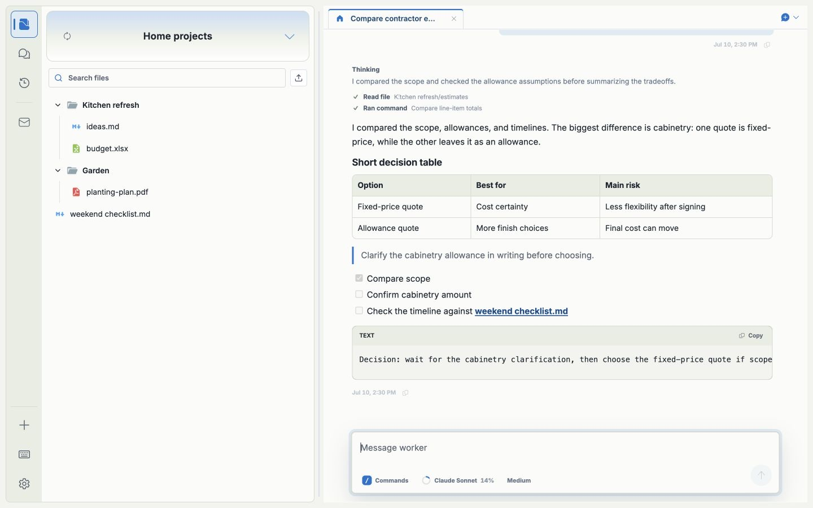

<p align="center">
  <picture>
    <source media="(prefers-color-scheme: dark)" srcset="desktop/assets/brand/lockup-horizontal-white.png" />
    
  </picture>
</p>

<p align="center">An AI Assistant for the folders you work in.</p>

<p align="center">
  <a href="https://www.work-fold.com/download/macos">Download for Mac</a> ·
  <a href="https://www.work-fold.com/">Website</a> ·
  <a href="CONTRIBUTING.md">Contribute</a> ·
  <a href="docs/README.md">Docs</a>
</p>



work-fold is an open-source Mac app that brings your files, AI conversations, and project tools together. Open a folder, tell the Assistant what you need, and work on the actual files. Research, writing, planning, code—whatever belongs in that folder.

For example: open a folder of vendor quotes, ask for a comparison, and have the Assistant write a decision brief beside the originals. Come back tomorrow and pick up the same conversation.

## A folder is a Space

Each **Space** has its own Assistant and conversations. Your files stay ordinary files, accessible in Finder and your existing tools.

**The fold** is the Assistant above your Spaces. Ask it what needs attention or have it coordinate work between projects, from the app or Mac menu bar. Hand a piece of work to one project's Assistant and it reports back here; if it needs something first it asks, and your answer picks the work up where it stopped.

As a project grows, ask for a custom **app** in its sidebar, add **Checks** to review chosen files, or set up a **routing** to run steps on a schedule or after selected files change. These are optional; start with a folder and a conversation.

What the Assistant does happens right away and leaves a record you can read in the app. Nothing it deletes is gone for good: **History** keeps versions of your files, and anything History cannot keep waits in **Recently deleted** for 30 days. Sharing a page, an app's access, and anything running on a schedule can all be turned off afterwards.

## Try it

1. [Download work-fold](https://www.work-fold.com/download/macos) for an Apple silicon Mac.
2. Connect your model provider in **Settings → Assistant**. Provider usage may cost money.
3. Open an existing folder or create a Space, then start a Chat.

Files live on your computer. Content used by the Assistant goes to your chosen model provider. Optional web access is in private alpha and needs your Mac online. See [Privacy](PRIVACY.md) for details.

## Help build work-fold

This is an actively developed independent project, and I'd love people to build and maintain it with me. UI polish, reliable tests, clearer onboarding, and real-world bug reports would all help.

[Open an issue](https://github.com/Mat-Tom-Son/work-fold/issues) with something you'd like to improve, or start with the [contributing guide](CONTRIBUTING.md). Small, focused contributions are welcome.

Built with Electron, React, TypeScript, and the [Pi agent runtime](https://pi.dev). To run a clone locally, use Node 24 (`.nvmrc`):

```sh
npm ci
npm run local:dev
```

Open **http://localhost:5173** for the browser development UI. See [Contributing](CONTRIBUTING.md) for native Electron and agent setup.

Check changes with `npm run check` and `npm test`; run `npm run desktop:prepare` for desktop integration changes. The [docs map](docs/README.md) covers architecture, product decisions, and release procedures. [AGENTS.md](AGENTS.md) is the shared contributor contract.

[MIT License](LICENSE) · [Security](SECURITY.md) · [CI](https://github.com/Mat-Tom-Son/work-fold/actions/workflows/ci.yml)


The [collaboration contract](docs/collaboration-contract.md#completion-delivery-and-recovery)
tracks work across model turns: durable questions and answer delivery, bounded
continuations for each owner, and selected request results. The request graph
and original assignments remain machine-local. Only deliberately released
child reports enter a Space Chat; app task reads remain pinned to their own
installation. See the contract for stop, expiry and restart behavior.

The [collaboration experience](docs/collaboration-experience.md) brings that work
into Chats, the fold, Apps, and the paired browser: visible progress, questions
answered in place, selected files that open directly, and explicit recovery for
saved work.
