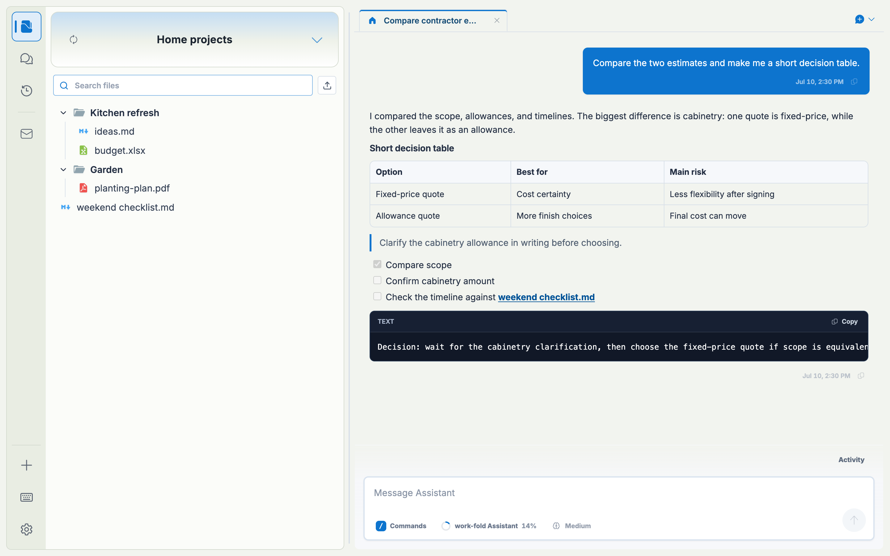
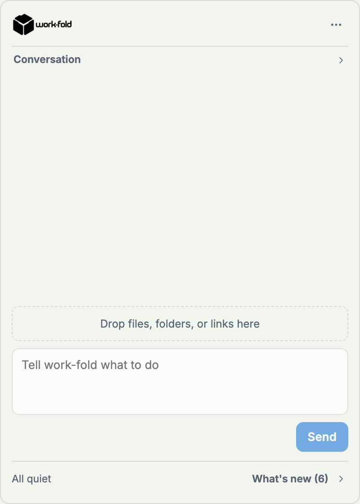
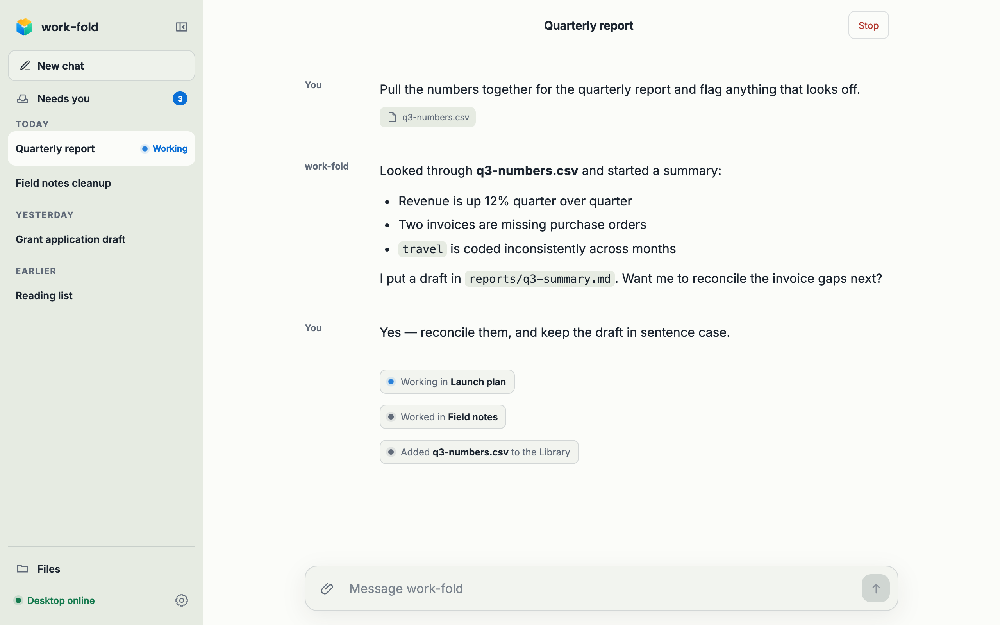

# work-fold

<p align="center">
  <picture>
    <source media="(prefers-color-scheme: dark)" srcset="desktop/assets/brand/lockup-horizontal-white.png" />
    
  </picture>
</p>

[](https://github.com/Mat-Tom-Son/work-fold/actions/workflows/ci.yml)
[](https://github.com/Mat-Tom-Son/work-fold-mac-releases/releases/latest)
[](LICENSE)

## Every folder, its own Assistant

work-fold is an open-source, local-first desktop environment for general computer work. Every **Space** is one ordinary folder with its own [Pi](https://pi.dev) Assistant, model, instructions, Chats, and tools. The folder remains open to Finder, Git, backup, and sync tools; work-fold never turns it into a proprietary container.

Above the Spaces, **the fold** is one manager Assistant that can inspect, organize, and delegate without blending every project into one context. Checks verify work, Routings start work later or across Spaces, restricted Space apps add useful interfaces, and receipts keep consequential actions visible.



## Get work-fold

[Download the signed and notarized Apple silicon Mac app](https://github.com/Mat-Tom-Son/work-fold-mac-releases/releases/latest), or visit [work-fold.com](https://www.work-fold.com/).

macOS is the active public distribution lane. Windows implementation seams remain in the repository, but Windows packaging and publication are inactive.

## How it works

### Spaces keep work focused

Register an existing folder or create a new one. Each Space keeps its own Files, Chats, History, model choice, instructions, Skills, Extensions, and apps. A Space Assistant works in that folder and receives only the context you explicitly give it.

The Library is one passive personal collection, opened through a Space-owned tab when you choose to copy material into a Space.

### The fold coordinates everything

The fold is a separate management conversation above all Spaces. Use it in the main app, from the Mac menu bar, through the `work-fold` CLI, or at a private web address while the desktop is online.



### Agents can build and come back later

- **Checks** validate exact designated files and keep the evidence.
- **Routings** start deterministic work manually, on a timer, or after a declared event.
- **Space apps** run Assistant-built interfaces in a separate sandbox with narrow grants.
- **Pages** publish one designated file through the desktop and can be revoked immediately.

Reviewed mode holds consequential actions for a person or matching standing policy. Unrestricted mode runs every newly admitted staged action immediately; approved browsers inherit the machine's setting. Both paths use the same receipts and domain rules.

### The web bridge keeps the desktop in charge

An approved browser can open saved fold Chats, browse filtered Space files, preview bounded text and images, open an app's reviewed web view, upload bounded attachments, and continue the management conversation. The current request links to copied files, files observed changing during child tasks, installed apps and pending reviews. Payloads cross the hosted relay in signed encrypted envelopes; the Mac remains the execution endpoint. See [file previews](docs/fold-file-previews.md) and [app views](docs/fold-browser-apps.md) for supported content and limits.

Apps can also request declared worker actions from
an approved browser. The fold shows exact inputs for review outside the app
frame and records the result; reconnecting never replays accepted work. Shared
viewers remain read-only.



## What travels

| Travels with a Space | Stays on each computer |
|---|---|
| Ordinary files | Provider credentials |
| `.work-fold/space.json` identity | Model choices and Space instructions |
| Append-only `.work-fold/conversations/` logs | Trust settings, sessions, and preferences |
| Inert `.work-fold/checks/` declarations and reviewed criteria | Check enablement, findings, decisions, and corrections |
| Project-owned `.pi/` configuration, when present | History restore points and machine app data |

Library materials, outside files, capabilities, connections, and browser access move only through explicit actions.

## What is here today

- Files, Chats, History, Search, attachments, image input, and a reusable personal Library.
- Pi's built-in tools, providers, model registry, Skills, Extensions, packages, reasoning levels, and native project configuration.
- Separate model selection for every Space and the fold, plus machine-local Space instructions that the fold can manage through receipted commands.
- Background Chat continuity, generated titles after the first successful turn, streaming Thinking and tool activity, and active/snoozed/archived Chat views.
- Space appearance customization and declarative Extension surfaces.
- Restricted Space apps with reviewed releases, installation, connections, storage, file grants, notifications, automations, updates, rollback, and removal.
- The app supports [app data export and recovery](docs/app-data-recovery.md), with data-only backups, current-revision restore, and Undo for clear/restore.
- The app also supports [Change this app](docs/app-changes.md): an exact installed-byte working copy, History, and a Chat draft, with predecessor checks on reviewed preview updates. App details links to the build Chat and exact update target. A Project's preview and installed Release can coexist in its source Space with separate data and authority.
- App views, tools and management controls retain exact installation identity, including across a same-code reinstall. CLI `--app` also accepts that exact identity when needed.
- The fold, Needs-you decisions, standing policies, the deterministic glance, Routings, Checks, published pages, and the authenticated management CLI.
- Private-alpha web access with desktop browser approval and live response streaming.
- Signed, notarized Apple silicon releases with automatic updates from the separate public Mac feed.

Google Drive currently works through a normal Drive-for-desktop folder, not a native Drive API. Provider OAuth and account-tier support remain provider-specific. See the product and security documents below for the exact boundaries.

## Develop locally

Use Node 22.19.0 or newer.

```bash
npm ci
npm run local:dev
```

Before handing off a behavior change:

```bash
npm run check
npm test
```

Run `npm run desktop:prepare` after Electron, packaging, or runtime-resource changes. The active Mac packaging and release commands are documented in [macOS builds](docs/macos-build.md) and the [macOS release runbook](docs/macos-release.md); do not treat the dormant Windows commands as an active release lane.

### Codex and Claude Code

[AGENTS.md](AGENTS.md) is the canonical contributor contract. Codex reads it directly; [CLAUDE.md](CLAUDE.md) imports it so both harnesses use the same product rails, tests, Skills, and release commands. Shared project Skills live once under `.agents/skills/`, with tracked `.claude/skills/` symlinks for Claude Code.

Start with [CONTRIBUTING.md](CONTRIBUTING.md) and [the product model](docs/product-model.md) before changing product behavior or terminology.

## Management CLI

The packaged app carries the `work-fold` command. Its read lane returns bounded, content-free context; its authenticated act lane uses the running app's normal trust, History, concurrency, staging, and receipt paths.

```bash
work-fold context --json
work-fold spaces list
work-fold manage send --message "What changed across my Spaces today?"
work-fold checks status --space "Vendor Audits" --json
```

See [the management layer](docs/management-layer.md) for commands, protocol guarantees, and the real-Pi-turn development driver.

## Documentation

The app supports [app-requested Assistant tasks](docs/app-assistant-tasks.md):
review a named request in Apps, run it in that Space, and return its bounded
reply to the app. The [integration record](docs/apps-fold-workflows.md) distinguishes
automated, real-model, native desktop and paired-browser evidence.

Start with the [documentation map](docs/README.md) for current contracts,
accepted future direction, and historical evidence.

- [Product model](docs/product-model.md) — durable nouns, context rules, product rails, and roadmap.
- [Architecture](docs/architecture.md) and [management layer](docs/management-layer.md) — runtime boundaries, kernel, CLI, and agent-facing adapters.
- [The fold](docs/fold.md), [Checks](docs/checks.md), and [publishing](docs/fold-publishing.md) — authority, decisions, Routings, evidence, and sharing.
- [Assistant capabilities](docs/assistant-capabilities.md) and [Pi compatibility](docs/pi-resources.md) — models, Skills, Extensions, packages, scopes, and trust.
- [App platform foundation](docs/app-platform-foundation.md), [restricted app authoring](docs/restricted-app-authoring.md), and [restricted app runtime](docs/restricted-app-runtime.md) — Assistant-built apps and their lifecycle.
- [Desktop parity](docs/ui-parity.md) and [visual system](docs/visual-design.md) — interaction and design contracts.
- [Release notes and candidate history](docs/releases/README.md) — published versions and unpublished test candidates.
- [macOS builds](docs/macos-build.md) and [release runbook](docs/macos-release.md) — active packaging, signing, notarization, and publication.

work-fold uses a clean product profile and never imports, migrates, rewrites, or deletes legacy Workspace state or `.workspace/` content. The old Workspace repositories are frozen and never receive work-fold releases.

## Project policies

- [Contributing](CONTRIBUTING.md)
- [Security](SECURITY.md)
- [Privacy](PRIVACY.md)
- [MIT License](LICENSE)


### Folder triggers and text Checks

Open **Checks** from Files or the command palette, then **Tell the fold what to check**. Review its proposal, **Try it**, and **Turn on** when ready. Manual setup remains available. Text review uses the fold's selected model with only the files and references you designate; it returns quoted suggestions without editing. Trials stay separate from live results; **Run Checks** starts enabled work. Findings offer **Ask Space Assistant to help**, followed by a reviewed correction with History and a fresh Check run. Model requests may incur provider charges, and supported inputs are bounded UTF-8 text (not automatic PDF/Word extraction).

Ask the fold to prepare a routing for a folder you name. A reviewed folder-change trigger combines stable edits with debounce and cooldown; its steps can wait for a Chat in one Space, copy that turn's outputs, then start a Chat or Check in another. Inspect and manage it in **Settings → The fold → Routings**. The awake desktop observes only the selected folder/types. Observation pauses during routing work and starts from a fresh baseline after work, sleep, or restart; edits during those pauses do not queue another run. See [Routings](docs/fold-routings.md) and [Checks](docs/checks.md).

History now previews the files a restore will write/remove and refuses changes that its safety checkpoint cannot recover. Nested registered Spaces and excluded descendants are protected; relinking a moved folder on this computer preserves its History. History remains bounded local recovery, not a substitute for an independent backup.

Space apps can declare Check-result choices. Select
one in the app's access controls to share its current status and verified
findings; this does not enable or run the Check. See [selected Check
results](docs/restricted-app-authoring.md#selected-check-results).
