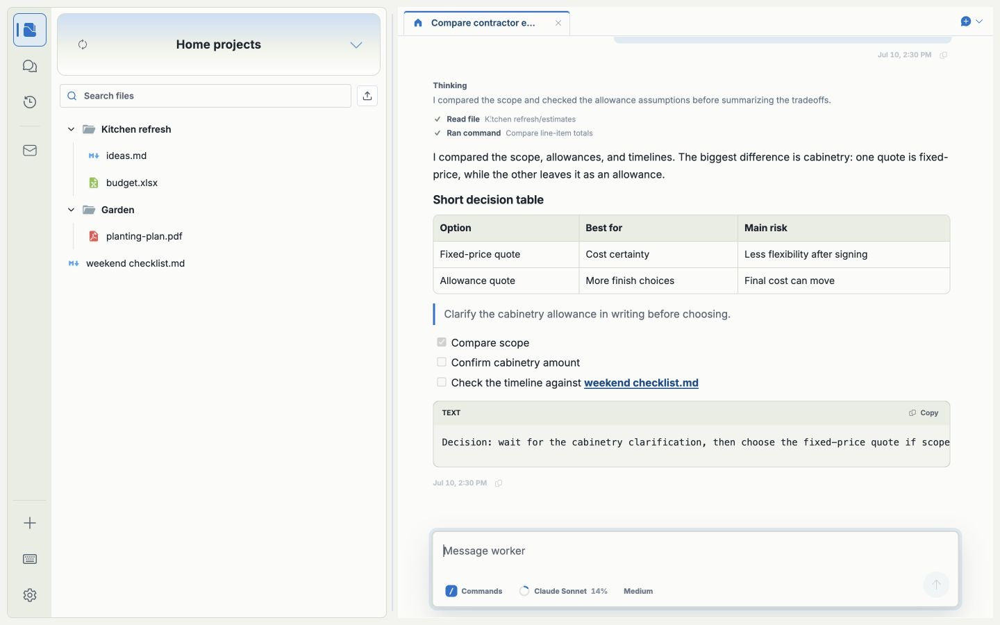

<p align="center">
  <picture>
    <source media="(prefers-color-scheme: dark)" srcset="desktop/assets/brand/lockup-horizontal-white.png" />
    
  </picture>
</p>

<p align="center">Workers for the folders you work in.</p>

<p align="center">
  <a href="https://www.work-fold.com/download/macos">Download for Mac</a> ·
  <a href="https://www.work-fold.com/">Website</a> ·
  <a href="CONTRIBUTING.md">Contribute</a> ·
  <a href="docs/README.md">Docs</a>
</p>



work-fold is an open-source Mac app that brings your files, AI conversations, and project tools together. Open a folder, tell its Worker what you need, and work on the actual files. Research, writing, planning, code—whatever belongs in that folder.

For example: open a folder of vendor quotes, ask for a comparison, and have the Worker write a decision brief beside the originals. Come back tomorrow and pick up the same conversation.

## work-folders and Workers

Each **work-folder** has its own **Worker** and conversations. Your files stay ordinary files, accessible in Finder and your existing tools. A work-folder is an ordinary folder you choose to work in; it is never converted into a proprietary container.

The **work-fold agent** is the agent above your work-folders. Ask it what needs attention or have it coordinate work between projects, from the app or Mac menu bar. Hand a piece of work to one work-folder's Worker and it reports back here; if it needs something first it asks, and your answer picks the work up where it stopped.

You can register work-folders inside another work-folder. The switcher shows
their hierarchy, and Files opens each nested work-folder in its own context.
Type `@` in a Chat or the work-fold agent's composer to address a Worker.
The local `work-fold work-folders list --json` projection includes `parentWorkFolderId`
for a nested work-folder; see [the work-fold agent and CLI guide](docs/work-fold-agent-and-cli.md).

As a project grows, ask for a custom **app** in its sidebar, add **Checks** to review chosen files, or set up an **Automation** to run fixed steps on a schedule or after selected files change. Automations are deterministic app-run steps, not a second kind of Worker or an open-ended agent scheduler. These are optional; start with a work-folder and a conversation.

What a Worker or the work-fold agent does happens right away and leaves a record you can read in the app. Nothing it deletes is gone for good: **History** keeps versions of your files, and anything History cannot keep waits in **Recently deleted** for 30 days. Sharing a page, an app's access, and anything running on a schedule can all be turned off afterwards.

Use **Compare** in Version History or a selected work-folder restore point to read saved text beside the current file before restoring. Binary, oversized, uncaptured, and incomplete comparisons explain their limits. The authenticated CLI offers paged `history list`/`versions`, verified `history read --offset-bytes 0` ranges for large saved text, and streaming `search` with `--path` narrowing and `--cursor` continuation; see `work-fold help history` and `work-fold help search`.

## Try it

1. [Download work-fold](https://www.work-fold.com/download/macos) for an Apple silicon Mac.
2. Connect your model provider in **Settings → AI Models**. Provider usage may cost money.
3. Open an existing folder or create a work-folder, then start a Chat.

Files live on your computer. Content a Worker uses goes to your chosen model provider. Optional Web Access is in private alpha and needs your Mac online. See [Privacy](PRIVACY.md) for details.

## Under the hood

Handed-off work is tracked as a durable request: a question
waits for its answer and continues once, and each Worker reports one result to
whoever asked. The request graph and original assignments stay machine-local;
only results a Worker deliberately releases reach another work-folder's Chat,
and an app's task reads stay pinned to its own installation. See the
[collaboration contract](docs/collaboration-contract.md#completion-delivery-and-recovery)
for stop, expiry, and restart behavior, and the
[collaboration experience](docs/collaboration-experience.md) for how progress,
questions, and result files appear in Chats, the work-fold agent, apps, and the
paired browser.

The work-fold agent's menu-bar popover has a **Chats** view that reopens saved
conversations and keeps unsent drafts while you switch. The paired web client
focuses on new and saved Chats, keeps questions inside the Chat that asked
them, and lists your **Shared pages**.

**Skills & Extensions** manages native Pi resources, package updates and
removal, and setup for the included Computer Control, Chrome, Web, Documents,
and Service Connections tools, which use the same Pi formats and tool loop as
Extensions you add. Computer permissions, the Chrome companion, and service
credentials are explicit setup; web search and the document runtime work
without them. An ordinary Extension's questions appear in its owning Chat and
end with Stop or the session; a Worker's durable questions keep their own
continuation contract. See [Extensions and computer work](docs/extension-foundation.md)
for supported jobs, dependencies, reviewed patches, and release acceptance.

Developers can inspect upcoming model calls through the local `?dev-context`
diagnostic route. Recording starts off, has no Chat or Settings entry, and
keeps assembled context, provider payloads, and source provenance in bounded
local memory. The [feedback contract](docs/tool-feedback.md) keeps Pi's tool
loop for text, data, and selected images without continuous screen recording.

## Help build work-fold

This is an actively developed independent project, and I'd love people to build and maintain it with me. UI polish, reliable tests, clearer onboarding, and real-world bug reports would all help.

[Open an issue](https://github.com/Mat-Tom-Son/work-fold/issues) with something you'd like to improve, or start with the [contributing guide](CONTRIBUTING.md). Small, focused contributions are welcome.

Built with Electron, React, TypeScript, and the [Pi agent runtime](https://pi.dev). To run a clone locally, use Node 24 (`.nvmrc`):

```sh
npm ci
npm run local:dev
```

Open **http://localhost:5173** for the browser development UI. See [Contributing](CONTRIBUTING.md) for native Electron and agent setup.

Check changes with `npm run check` and `npm test`; run `npm run desktop:prepare` for desktop integration changes. The [docs map](docs/README.md) covers architecture, product decisions, and release procedures. [AGENTS.md](AGENTS.md) is the shared contributor contract.

[MIT License](LICENSE) · [Security](SECURITY.md) · [Development](docs/development.md)
