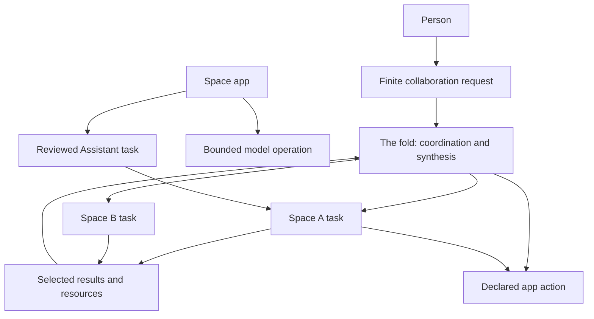

# Assistant collaboration and app AI primitives

> **Status:** Proposal for discussion, not accepted implementation scope.
> **Assessment date:** 2026-09-09.
> **Source baseline:** `6830942`, package version `0.4.23`, initially clean checkout.
> This document distinguishes shipped behavior from proposed contracts. It does
> not amend the product model, F8/F9, root authority, or restricted-app grants.

The desired experience is that a person can ask for an outcome, the fold and
Space Assistants can divide the work and exchange selected results, and custom
Space apps can both use AI and contribute actions to that work.

The code already supplies the runtime, turn journal, app isolation, schemas,
grants, and much of the execution machinery. The largest gaps are composition,
durable request lineage, explicit data transfer, and a bounded app model lane.
Teaching every Space the entire management vocabulary would not by itself
close those gaps.

The purpose is architectural coherence, not a ranking of feature additions.
Agree the ownership, context, execution and authority semantics first, then
derive implementation boundaries from them.

## Verified assessment

| Earlier claim | Finding in the current tree |
|---|---|
| The fold and Space Assistants share a runtime. | Correct. Both use native full-trust Pi sessions. The fold gets its materialized management resources and registry/task context. Space sessions get their own resources, saved instructions, proposal tool, and installed app tools. See [session construction](../src/local/agent/pi-client.ts), `ensureSession`, and [host composition](../src/local/server.ts), `getClient`. |
| Space Assistants have no task id or management-layer citizenship. | Narrow this: every accepted turn already has a kernel task and durable turn id. Only the fold receives its id in model-facing context. There is no equivalent app-owned Space operations guide or first-class child reporting channel. See `PiTurnContext`/`buildTurnContextMessage` and `acceptConversationTurn`/`runAgentTurn`. |
| Fold-to-Space delegation is well built. | Largely correct. Exact-turn send/status/result/wait, History, transcript reads, and attributed children exist. The rich request graph is bounded **in-memory** state; restart-safe turn records and receipts do not reconstruct it. A durable collaboration request is still missing. See [request registry](../src/local/management-requests.ts) and [turn journal](../src/local/agent/turn-store.ts). |
| Space-to-fold is a side door. | Correct as a product-contract gap. Packaged Assistants inherit the same CLI and profile, and the per-launch token does not distinguish same-user callers. `manage.send` carries no child-to-parent relationship; supported `--parent-task` attribution validates active management parents. A task id is not an authentication credential. See [CLI environment](../desktop/src/main.ts), `configureCliEnvironment`, [act commands](../src/local/cli/act-commands.ts), and [management contract](management-layer.md). |
| Space-to-Space is routings only. | Too absolute. Interactive coordination already happens through the fold, and the same full-trust CLI is physically reachable from Space shells. What is missing is a sanctioned peer request/handoff contract. Routings have only `chat`, `files`, and `check` steps, with literal Chat messages and a bounded created-files handoff. See [routing declarations](../src/local/routings/routing-declarations.ts). |
| There are no structured deliverables. | True for a general Assistant task result, not for the entire platform. Task results expose prose; durable turn metadata includes bounded changed-file paths, hashes, sizes and checkpoint ids. App tools already declare input/result schemas. The missing piece is an explicit, validated task result plus selected resource references. See [turn file records](../src/local/agent/turn-file-changes.ts) and [act result types](../src/local/cli/act-facade.ts). |
| There is no way to ask a person. | Ordinary Chat questions and replies work. The missing primitive is a durable question with a typed answer and continuation identity. The fold's conversational `needs_you` classification checks whether the last nonempty reply line ends in `?`. See [server](../src/local/server.ts), `managementReplyAsksQuestion`. |
| Apps need human review for every integrated Assistant request. | Correct. `assistant.request/list/get/cancel` is available to active native app views. Approval creates a fresh full-trust Space Chat; successful text is bounded to 32 KiB. It is a separate human-send lane, not a staged act automatically governed by Unrestricted mode. Workers, automations, viewers and remote app views do not receive this bridge. See [Assistant task contract](app-assistant-tasks.md) and [task service](../src/local/agent/restricted-app-tasks.ts). |
| Apps have no bounded model call. | Correct for the host's configured AI runtime. A separately granted external network API is not an integrated host AI primitive. The Check reviewer and Chat-title generation provide existing bounded native transport precedents. See [Pi client](../src/local/agent/pi-client.ts), `reviewCheck` and `generateConversationTitle`. |
| Apps are poll-only / have no subscriptions. | Incorrect broadly. `storage.onChanged` already provides bounded active-view invalidations, and `context.onChanged` provides view context changes. Task, Check, and granted-file subscriptions are missing. Internal control events and settle signals are not public app workflow buses. See [native preload](../desktop/src/restricted-app-preload.cts) and [storage contract](restricted-app-runtime.md#storage-and-space-files). |
| Apps can read one selected Check. | One Check per grant, with up to eight declared Check slots. Reads do not confer run authority or general file access. See [Check bridge types](../src/shared/restricted-app-checks.ts). |
| Space Assistants have no Library or glance verbs. | The CLI already has `library.*` and `manage.glance`; they are accessible to same-user full-trust shells. There is no specifically taught and scoped Space-facing projection. A global glance would also introduce other Spaces' context into the portable-transcript problem. |
| Preview updates wipe grants, connections, jobs and run receipts. | Changed preview bytes reset live grants, connections and jobs, but preserve installation/data identities and stored data. Historical automation receipts survive outside the current-revision run list. Identical-digest installs are idempotent. Release-backed updates may retain eligible authority for exact unchanged Features. See [preview install](../src/local/agent/restricted-app-service.ts), `install`, and [regression coverage](../tests/restricted-app-service.test.ts). |
| No fold-side app invocation, general receipts list, Library remove, or read-lane routing status. | Confirmed for the installed CLI vocabulary. Fold-side automation runs already exist. Typed app invocation exists from Space Pi tools and a separate reviewed private-browser worker-action lane, so reuse those domain mechanisms. General act receipts exist durably but lack a general list/show CLI projection. See [act vocabulary](../src/local/cli/act-commands.ts) and [read vocabulary](../src/local/cli/commands.ts). |

An additional discoverability gap: `propose_space_app`'s model-facing builder
guide describes storage hints and many existing brokers, but omits
`assistantActions`, `assistant.request`, and `checks.read`. The authoring docs
cover them. Builders should be taught the primitives that already shipped.

## Design questions to resolve together

These are related decisions, not independent feature requests. Proposed
answers below provide a concrete basis for discussion rather than assuming the
existing restrictions must remain forever or that every restriction is a gap.

| Question | Proposed answer and consequence |
|---|---|
| What is a Space boundary? | A context and portability boundary in the full-trust Assistant product; an enforced grant boundary for restricted apps. Shared contracts must not claim those are identical security guarantees. |
| What is the unit of work? | A request owns an outcome and may span multiple tasks and Pi turns. A Chat is the conversational record. Neither an individual model turn nor a Chat transcript should be the scheduler. |
| What does “prompt each other” mean? | Distinguish requesting work, reporting progress, delivering a result, and asking for input. Each names a recipient and correlation identity. An arbitrary text message should not implicitly create a new autonomous turn. |
| Must every exchange run the fold model? | No. The host can deliver already-authorized assignments/results deterministically. The fold provides cross-Space reasoning when needed; it need not be an expensive model relay on every edge. |
| What does sharing confer? | Access to the selected payload/version for a named purpose and consumer. It does not imply access to its source transcript, folder, Library collection, or app namespace. Sharing and including material in model context remain distinct. |
| What can use the AI runtime? | Apps can request bounded inference; authorized Assistant tasks can use full Pi work. Both share transport, identity, usage and receipt conventions, while keeping their different execution authority explicit. |
| What happens after a reply or event? | Data delivery and UI invalidation do not themselves authorize more work. A continuation belongs to an existing finite request; repeated unattended work requires an explicit standing declaration. |
| How much ceremony should collaboration need? | Work within an already-authorized request proceeds without asking again at every edge. Newly widened authority, a new recipient outside the request, or standing behavior follows the relevant existing decision path. The person sees the outcome, scope and controls, not the internal protocol. |

For each primitive, specify the same contract dimensions: owner, recipient,
input/output shape, authority, context admission, lifecycle, cancellation,
idempotency/recovery, retention, usage limits, and available host surfaces.
This is more useful than equating “available everywhere” with “unrestricted
everywhere.”

## Proposed target model

Use existing services beneath a small common contract; do not replace Pi or
make the kernel a second execution engine. Shared semantics do not require
every participant to receive the same authority.

The proposed participant matrix makes that distinction concrete. It describes
intended semantics, not currently callable methods:

| Participant | Work requests | Context/results | App actions and AI |
|---|---|---|---|
| The fold | Coordinate a person-authorized request across selected Spaces; receive attributed upward requests. | Keep the coordination graph machine-local; explicitly release selected payloads into Spaces. | Invoke exact declared app actions; delegate full Assistant work. |
| Space Assistant | Execute its assignment; report, ask, or request a handoff under that request's authority. | Receive its own context and selected imports; no automatic global transcript/registry injection. | Invoke local app actions using current grants; retain native full-trust Pi behavior. |
| Native app view | Request declared Assistant work through the appropriate authorization path. | Read only owned task results and granted resources. | Use granted bounded inference; publish declared actions to the Assistant. |
| App worker/named job | No ambient management or arbitrary Assistant spawning. Repeated delegation, if added, needs its own explicit contract. | Use its invocation's granted data and result scope. | Bounded inference only when its declaration and current grants allow it; jobs stay Space-owned. |
| Approved browser | Exercise the permitted management surface with its existing browser identity and authority. | Preserve browser ownership filtering and explicit resource admission. | Native app powers do not automatically become browser app powers; each adapter needs conformance evidence. |
| Shared viewer | No work initiation or continuation authority. | Read only the published projection. | No inherited Assistant, model-use, or action power from possession of a viewing link. |

For a waiting child, the state sequence should be explicit: its Pi turn settles,
the logical task remains waiting for input, the root request remains incomplete,
and one admitted answer starts a new linked turn. The old turn does not resume
or execute twice. A root Stop prevents that continuation even if an answer
arrives concurrently. These semantics belong in the host, independent of
whether the question arrived through Chat, CLI, or an app.

### 1. Tasks and finite collaboration requests

Promote the current management request projection into a durable machine-local
request record that links existing turns, app invocations, and questions.
Keep turn acceptance and outcome authority in the existing turn service.

- Record root request, parent task, source surface, owning Space/conversation,
  app installation when applicable, input/result references and authorizer.
  Derive these at host entry points. Treat full-trust CLI attribution as the
  documented same-user lineage, not proof of an isolated caller.
- Supply every Space turn with its own host-owned task context and a compact
  guide to local operations. A delegated child gets its assignment and opaque
  parent handle, not the fold transcript or a global Space inventory.
- Support explicit report, request-input and handoff-request operations.
  A report is data to an established parent. A new upward request should be
  visibly offered to the person unless already within an active request's
  authorized scope; it must not silently wake an arbitrary fold conversation.
- Let the host route a handoff. The source Space contributes only its selected
  output and the request for help. A destination already authorized by the root
  request can resolve mechanically; the fold supplies coordination when a new
  decision is needed. Dispatch a scoped assignment through normal acceptance.
- A request can span several Pi turns. Waiting for a person or parent should
  yield the current turn and release execution capacity; it must not keep a
  model or shell waiting while the parent is itself waiting for that child.
- Finite continuations need explicit limits: allowed participants, deadline,
  maximum child tasks, turns/depth, concurrency and provider-use budgets.
  Numbers should be chosen in the first contract, not left to prompt prose.
- Stop cascades through the owned request graph. App/Space revocation prevents
  new dispatch and invalidates affected result access. Reconcile with durable
  turn outcomes after restart; never replay an uncertain tool-bearing turn.
  Budget exhaustion, interruption and partial completion are visible states.

For illustration only, the operations might be `task.report`,
`task.requestInput`, and `task.requestHandoff`. Final CLI/API names are deferred
until the contract is agreed. Simply broadening `--parent-task` to arbitrary
ids would not implement these semantics.

### 2. Typed results and explicit resource transfer

Add a result envelope with a human summary, optional schema-validated JSON,
selected resource references, and an explicit completion outcome. Reuse the
app platform's bounded closed schema subset initially. Invalid structured
output must be a visible result-validation failure, not silently accepted prose.

Resource kinds should start with a task result and a selected file version.
Later add selected Chat excerpts, History versions, Library items and app
records through adapters owned by those domains. References carry exact source
identity, revision/digest, freshness and permitted consumer. An id alone never
authorizes reading it. A view/open reference and a reference admitted into model
context are separate operations.

Use the existing copy/History paths when transferring files into a Space.
Distinguish a live path from a pinned version and refuse a changed input when
the caller requested exact bytes. An observed file diff is evidence of changes,
not a declaration that every changed file is a deliverable. Start with selected
resources rather than automatically attaching a transcript or entire app store.

Keep the cross-Space graph, source routing details, and receipts machine-local.
Only deliberately released payloads enter a destination's portable Chat.
Schema validation proves shape, not factual correctness or trustworthiness;
model/app output must remain data rather than authority to launch new work.

### 3. Questions and answers

Represent a question with an id, originating task, intended respondent
(person or parent), prompt, bounded answer schema, state, and expiry/cancel
behavior. Keep informational answers distinct from authority decisions:
answering a question must not approve code, grant power, or change root mode.

The trusted desktop/fold surface presents the question. One accepted answer
produces one attributed continuation, with a fresh turn request id and a link
to the waiting task. Duplicate, stale and wrong-recipient answers are refused.
Preserve ordinary free-text Chat conversation as a supported interaction.

### 4. Bounded app AI operations

Add a separately declared inference lane for extraction, classification,
summarization and transformation. Reuse native Pi authentication/model
transport; keep the Check-specific criteria and evidence admission separate.
Do not turn every AI operation into a Check or a full Assistant Chat.

An illustrative declaration names an action, purpose, fixed instructions,
input/output schemas, and requested input/output bounds. The trusted host
owns system instructions and selects the model. Prefer the owning Space's
configured model as the initial default, resolve it per operation and record
the effective model; expose failure when unavailable rather than silently
borrowing another scope's model.

The grant binds the exact installed revision/action, model policy, provider
disclosure, caller surface, and host-enforced usage limits. Enforce per-call
bytes/tokens/deadline, per-installation rate/concurrency, and aggregate budgets
before dispatch; account for usage after completion without treating missing
provider pricing as zero cost. No conversation history, shell, file tools,
general tool loop, or credentials enter the app's inference contract.

Start with active native views. Permit explicitly enabled named Space
automations later through the intersection of action grants, job declarations
and current authority. Use a durable invocation identity and receipt, cancellation,
validation, and authority rechecks before dispatch and delivery. Revocation
cannot undo a provider request already sent or guarantee zero charge.
Viewers receive no new model authority. Browser support is a separately tested
adapter, not an inference made from an API existing on desktop.

Retain `assistant.request` for work that needs the Space's full Assistant.
Standing grants for repeated full-trust Assistant tasks are a further product
decision; a named prompt or output schema is not a sandbox for Pi's tools.

### 5. Declared app actions and owned state

Expose fold-side app discovery and exact-installation action invocation through
the act facade, backed by `RestrictedAppService.invoke` and the existing host
schema/grant checks. Carry request lineage, durable acceptance/outcome receipts,
input/result validation, cancellation and effect-time authority through the
entire path. The fold should not need a sacrificial Space Chat to invoke a tool
that is already declared and granted.

Add scoped task/receipt reads so a Space or app can explain its own work without
reading unrelated global state. Preserve content-free protocol v1; keep
content-bearing projections in authenticated, explicitly scoped lanes.

Extend the existing invalidation pattern with owned task changes and selected
Check/file-grant changes where useful. Subscribe to exact owned ids, emit
bounded hints, and re-read authoritative state after reconnect/reset. These
view updates must not start model turns. Durable request continuations belong
to the finite task coordinator; scheduled work belongs to named Space jobs or
declared routings. Do not expose the internal settle signal as a public bus.

## Product decisions required

| Contract | Proposed decision |
|---|---|
| F9: cross-Space work never runs in a Space Chat | Preserve coordination above Spaces; explicitly permit host-mediated export/import of selected task payloads and upward requests. A machine-local mailbox alone does not prevent a model from repeating received private content in its portable reply. The destination release boundary must be explicit. |
| F8: unattended agency lives in Spaces | Allow bounded continuations of a person-initiated collaboration request, if desired, while retaining the ban on scheduled or arbitrary event-driven fold conversations. This is a deliberate extension, not merely a polling optimization. |
| Full-trust Assistant model | Keep it unless separately changed. Removing CLI hints or adding an actor label cannot fence a native Bash/read/write Assistant from same-user files or tokens. Hard isolation would require a separate runtime/security design. |
| App Assistant authority | Introduce a separate bounded-inference grant under existing staged widening-power mechanics, respecting Reviewed/Unrestricted admission. Keep current one-off Assistant review semantics until repeated full-trust task authority is expressly designed. |
| Preview update continuity | Preserve current safe defaults. Offer a concrete review of which previous grants to reissue to the newly reviewed digest. Unchanged permission names do not make changed code equivalent. Never carry pending task approvals forward. |

Promote agreed changes together into the owning product, management, fold,
app-foundation, app-task and runtime contracts, plus security/privacy docs and
the canonical contributor guide where relevant. Do not create harness-specific
policy or a work-fold-specific replacement for Pi's Skills and Extensions.

## Design validation before implementation scope

Use complete journeys to test the proposed contracts together. These are
architecture acceptance cases, not ranked features or a delivery commitment.

| Journey | Contracts it exercises | Acceptance proof |
|---|---|---|
| Discover and build | Compact Space operations context; current app builder guide; availability/limits declarations. | A fresh Space Assistant can discover supported local operations and author an app using the existing Assistant and Check bridges without reading this repository. |
| Delegate and clarify | Durable request, child context, typed result/resources, question/answer continuation and request-wide stop. | The fold delegates to A; A asks for missing input; a reply continues exactly once; A returns JSON plus a selected file; the fold gives a final result. Restart preserves attribution and never replays a completed effect. |
| Request help from a Space | An upward request with an explicit originating task, recipient and response destination. | Work started in a Space can reach the fold when authorized, including without a pre-existing parent. Cross-Space reasoning stays machine-local; only an explicitly released answer enters the originating Space. |
| Use AI inside an app | Native inference, declared schemas, explicit grant, budgets, cancellation and receipts. | An app classifies supplied records and consumes validated JSON without creating a Chat. Invalid schema, denied grant, budget exhaustion and revocation are visible and tested. |
| Compose Spaces and apps | A-to-B selected transfer, exact app action invocation, owned status/receipt reads and invalidations. | A produces a deliverable, B receives only the authorized payload, and either Assistant can invoke the appropriate declared app action. The app shows the outcome with attribution. No fold model call is required merely to transport a permitted result. |
| Repeat, update and recover | Named jobs, current grants, revision transitions, durable identity and available host surfaces. | A separately enabled job stays within limits; code changes expose the authority transition; restart does not replay effects; unsupported worker/browser/viewer powers fail honestly. |

An integrated demonstration could use ordinary work: a quote-comparison
app extracts structured facts, asks the Space Assistant for a comparison when
needed, returns a selected report to the fold, and lets the fold commission a
second Space to draft a response from only that report. A person can answer a
question, inspect the lineage, and stop the entire request.

Pressure-test the same contracts with different work, such as manuscript
review with citations and a household inventory app. If either needs to scrape
transcripts, poll arbitrary files, inherit unrelated grants, or invent another
task lifecycle, revise the primitives before committing to an API.

The planning output should be a short decision record plus a participant/host
capability matrix and state-transition examples for these journeys. Once those
agree, assign responsibilities to existing services, version the wire records,
and derive implementation work. Clipboard, Library removal, extra routing step
kinds and similar additions can then be evaluated as uses of the agreed model.

## Verification and limits of this assessment

Static review covered runtime construction, model-facing instructions, turn
acceptance/context/results, management request lineage, CLI vocabularies,
restricted-app preload/task/install behavior, routing declarations and settle
signals, and the owning product contracts.

On Node 24, **57 tests passed** across:

- `tests/management-turn-context.test.ts`
- `tests/management-requests.test.ts`
- `tests/restricted-app-tasks.test.ts`
- `tests/restricted-app-service.test.ts`
- `tests/restricted-app-storage.test.ts`
- `tests/turn-file-changes.test.ts`

`npm run repo:check` passed before the proposal, and the same repository checker
passed on Node 24 after the documentation changes. This is a code and focused
regression assessment, not a fresh installed-app, real-provider, or full-suite
acceptance run. No runtime behavior was changed and no external service was
invoked. Implementation will need the repository's TypeScript, behavior,
desktop, and relevant bridge gates in addition to focused tests for duplicate
delivery, waiting-state deadlocks, restart recovery, scope disclosure, budget
accounting, revocation, and app/Space removal.
