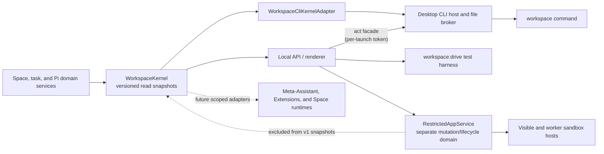

# Workspace management layer

Workspace now has a small management layer over its existing product model. It gives the renderer, command line, test harnesses, and future Assistant-facing adapters one semantic view of Spaces, running work, and Pi capabilities without creating another data store or agent framework.

This is infrastructure, not another navigation item. **Workspace**, **Space**, **Files**, **Chats**, **Library**, **History**, and **Assistant tools** remain the user-facing nouns. The management layer makes their underlying state inspectable in a consistent, versioned form.

## Why it exists

The desktop UI already knows how to work with Spaces and Pi, but a higher-level Assistant, an Extension, a script, or a future Space runtime also needs answers to basic questions:

- Which Space applies to this actor and working directory?
- Which Spaces are registered?
- Which Assistant turns or Chat compactions are still running?
- Which Skills, Extensions, tools, packages, prompts, themes, and commands are available in this Space, and what are their scope, source, trust, and load states?

Those answers should not be reimplemented by every consumer. `WorkspaceKernel` is the shared in-process read authority that produces them.



Domain services still own writes. The kernel does not bypass folder grants, registered-Space authorization, capability-mutation locks, History behavior, or any other mutation policy.

The dotted restricted-app edge is a boundary, not a data flow into the kernel. Space apps have their own reviewed package, grant, encrypted connection, storage, named-automation, notification, and sandbox-host state. Protocol v1 and `workspace.capabilities` intentionally do not list or mutate that state. The machine-wide automation scheduler is an in-process execution coordinator for that domain, not a management-protocol mutation surface. Future app inventory belongs in a deliberately versioned kernel snapshot only after its content and authorization contract are designed.

## Kernel contract

`src/local/workspace-kernel.ts` defines `workspaceKernelSnapshotVersion` and a normalized actor context:

```ts
interface WorkspaceActor {
  kind: "human" | "assistant" | "cli" | "renderer" | "extension" | "app" | "system";
  cwd?: string;
  workspaceId?: string;
  conversationId?: string;
}
```

Space resolution is deterministic:

1. An explicit `workspaceId` wins.
2. Otherwise, the most-specific registered Space whose root contains `cwd` wins. This matters when registered Space roots are nested.
3. Otherwise, the result has no Space context.

The current snapshot version is `1` and exposes four read models:

| Snapshot | What it contains |
|---|---|
| `workspace.context` | Normalized actor, resolution method, and resolved Space or `null`. |
| `workspace.spaces` | Registered Space identities, roots, ownership/location metadata, and timestamps. |
| `workspace.tasks` | Running `assistant_turn` and `compaction` records, optionally scoped to one Space. |
| `workspace.capabilities` | Pi's authoritative capability catalog plus packages, project authorization, mutation eligibility, provenance, and diagnostics for one Space. |

The local API and the desktop CLI share one kernel instance. Assistant turns and Chat compactions register a task when work is accepted and finish it in success and failure cleanup paths. Capability mutations remain blocked while affected work is active, so a catalog reload cannot silently terminate a background turn.

Capability snapshots are projections of Pi's native catalog. They do not create a second full-trust registry, activate inactive tools, bypass the Space registry, or install anything.

## Workspace CLI

The Windows installer places `workspace.cmd`, an extensionless `workspace` shim, and the private `workspace-cli.ps1` helper in `<install>\bin`, then adds that directory to the current user's `PATH`. The Mac bundle places the extensionless shim and `workspace-cli.jxa.js` under `Workspace.app/Contents/bin`; Workspace adds that directory to child-process `PATH` for Pi shell tools without editing a person's Terminal profile.

```powershell
workspace context --json
workspace spaces list
workspace tasks list --space "Personal Space"
workspace capabilities list --space "Personal Space" --json
workspace version
workspace help capabilities
```

`--space <id-or-exact-name>` selects a Space explicitly. Without it, Space-aware read commands resolve the terminal's current working directory. Duplicate exact names are rejected as ambiguous; use the stable Space id in automation. `--json` emits the stable protocol projection and is the preferred interface for scripts, Codex, Claude Code, and other shell-capable harnesses.

The read commands stay content-free: Space names and paths, task metadata, and capability metadata — no file contents, conversation text, credentials, or provider tokens.

The same command also carries the **act lane** — the separately versioned, per-launch-authenticated surface through which a shell-capable agent can operate the product while the Workspace app is running:

```powershell
workspace chat create --space "Home"
workspace chat send --space "Home" --new --message "File the material I dropped."
workspace chat send --space "Home" --conversation <id> --message-file notes.md
workspace chat status --space "Home" --task <task-id> --json
workspace chat wait --space "Home" --task <task-id> --timeout 900 --json
workspace chat result --space "Home" --conversation <id> --messages 5 --json
workspace chat abort --space "Home" --conversation <id>
workspace chats list --space "Home" --json
workspace spaces create --name "Vendor Audits"
workspace spaces register --path /Users/me/Projects/existing-folder
workspace files add --space "Vendor Audits" --from ./report.pdf --to "Inbox" --json
workspace manage send --message "File everything I dropped into the right Spaces."
workspace manage wait --task <task-id> --json
```

`workspace manage …` talks to the **management conversation** — the one conversation above all Spaces. It reuses the same acceptance path, Pi runtime, kernel task records, and task-scoped outcome semantics as Space Chats under the dedicated scope id `workspace-management` instead of a Space id. Its transcript lives in machine-local application state under the app profile's `management/` root — it describes this machine's registry, so it is deliberately not portable Space data. Its Pi session loads personal-scope Skills and Extensions plus exactly two app-materialized project resources — a management `AGENTS.md` context file and the `manage-workspaces` Skill, rewritten on every start — and gets no user Space's `.pi` configuration, no restricted-app bridges, and no History checkpoints (History is a Space concept).

Those two app-owned resources are required, not an optional enhancement. If Workspace cannot materialize them safely, ordinary Spaces and the desktop may still start, but management commands fail closed until the management folder can be prepared; Workspace never runs this full-trust scope as an unidentified, uninstructed Assistant.

Be precise about its authority: the management conversation is a **full-trust Assistant, taught rather than caged**. Like every Workspace Assistant it keeps Pi's ordinary read/bash/edit/write tools, which accept absolute paths anywhere this user can reach. The materialized instructions teach it to prefer the `workspace` read and act commands for anything that touches Spaces — those carry the trust grants, restore points, receipts, and conflict rules — but that preference is instruction, not an enforced authority boundary. An enforced CLI-only management agent would be a different, deliberate design (per-session tool restriction) that this personal, local product has not adopted.

Without `--conversation`, manage commands target the most recent active management conversation, `manage send` creates it on first use, and `--new` deliberately allows additional threads while the default stays a single conversation; management turns appear in `workspace tasks list` under the management scope id.

Space-targeted act commands never resolve a Space from the working directory — every write names its Space explicitly. `chat send` accepts a CLI-initiated Assistant turn through the exact same acceptance path as the renderer (conflict checks, kernel task record with a `cli` actor, portable transcript persistence, pre/post-turn History checkpoints) and returns a task id. That task id is how a caller follows exactly its own turn: the app keeps each accepted turn's terminal outcome (`succeeded`, `failed`, or `aborted`, with the persisted response message id or the failure message) for the rest of the app run, `chat status --task`/`chat result --task` read it, and `chat wait --task` is a shim-side poll that finishes with that turn's own result — a failed or aborted turn exits non-zero instead of presenting an older transcript message as success (wait timeout exit code 7). `chat status|result --conversation` remain the transcript-scoped views. `files add` copies outside material in with a targeted restore point that succeeds or fails together with the placement, and `spaces create`/`spaces register` grant the same registered-Space runtime authorization as the desktop actions. Content-bearing chat reads (`chat status|result`, `chats list`) belong to the act lane too, so the read lane keeps its content-free property. When the interactive app is not running, act commands fail fast with "Open Workspace…" and exit code 6.

## Desktop handoff

The public command does not run Electron as Node; the `RunAsNode` fuse remains disabled. Instead it uses a bounded protocol-v1 file handoff:

1. The shim writes an atomic UUID-named request beneath the owning app's platform profile containing the arguments, current working directory, protocol version, and timestamp. An installed production app uses `%APPDATA%\Workspace\cli\requests` on Windows or `~/Library/Application Support/Workspace/cli/requests` on macOS. An uninstalled Windows package uses `%APPDATA%\Workspace Development\cli\requests`, and the separately identified Mac smoke app uses its own product directory. Packaged child commands receive that exact root through the CLI-only `WORKSPACE_CLI_STATE_DIR`; desktop state selection never reads it.
2. It starts or contacts the exact installed Windows executable or Mac app executable with that request id. Electron's single-instance handoff routes the request to the existing desktop host when the app is already open.
3. The desktop host claims and serializes the request, executes it through `WorkspaceCliKernelAdapter`, and atomically writes stdout, stderr, structured result, and exit code beneath `responses`.
4. The shim returns that output and removes its request and response files. The broker also removes stale bounded files during initialization.

A CLI-only launch can initialize the host, process its queue, flush Pi state, and exit without showing the interactive window. If the GUI is already running, the command uses the same kernel and live task registry as the renderer.

The broker rejects unsafe roots, symbolic-link or non-regular request files, path escapes, oversized payloads, stale timestamps, future clock skew, duplicate claims, and unsupported fields. These checks make the handoff bounded; they do not authenticate the caller.

## Security boundary

The platform CLI directory is a same-operating-system-user coordination channel, not a public API or authenticated caller boundary. Another process running as the same user may be able to submit requests and read the resulting local metadata. Protocol v1 therefore remains read-only; mutations are never added to it.

The act lane is the separately versioned write surface (`src/local/cli/act-protocol.ts`, protocol version 2) that satisfies the requirements a write surface was always going to need — in the smallest form that is honest for a personal, local product:

- **Per-launch request authentication.** The interactive app mints a random act token every run, writes it to `cli/act-token.json` (0600 on POSIX; Windows relies on the profile directory's ACLs), and removes it on shutdown. Shims attach the token to each act request; the desktop host compares it in constant time. On a single-account machine the OS user is the principal — the token binds requests to *this app run* and keeps stale or crash-residue requests inert; it does not pretend to distinguish same-user callers.
- **Freshness and at-most-once execution.** Act requests reuse the broker's bounded, atomic, freshness-checked claim path; a pending request id returns its recorded response, and after the shim cleans those files up, the journal's `accepted` records refuse a duplicated id outright instead of re-executing the mutation. The broker refuses requests older than its freshness window, and journal rotation holds entries at least that long, so the two windows compose into a durable at-most-once guarantee.
- **Explicit scope.** Every act command names its Space; there is no working-directory resolution for writes. Chat commands additionally name their conversation or task.
- **Journal-first receipts.** Every authorized act command appends an `accepted` line to `cli/receipts/act.jsonl` **before** its mutation runs — an unwritable journal refuses the command — and a terminal `ok`/`error` line after (timestamp, command, Space/conversation ids, outcome, error code, History checkpoint id, kernel task id). A crash can separate the pair, but an applied action can never be missing its `accepted` trace; a missing terminal record is itself the honest signal that the outcome was interrupted. Terminal-record failures surface as a warning on the command's stderr.
- **Existing policy checks.** Act execution happens through an in-process facade the interactive local API exposes on its handle, reusing the same route internals as the renderer — registered-Space trust grants, capability-mutation locks, turn-conflict rejection, History checkpoints, and kernel task records included. Without the running interactive app there is no facade and nothing mutates.

Chat-scoped authorization (a token that may only touch one Chat), confirmation ceremonies, and revocation of individual grants remain future work for any surface that outgrows the personal single-user boundary.

## Agent harness versus management CLI

The management CLI inspects the running product. `workspace:drive` serves a different purpose: it runs one real Pi turn through the same local API, built-in tools, Skills, Extensions, persistence, and event stream as the desktop app.

```powershell
npm run workspace:drive -- --workspace C:\path\to\space --prompt "Summarize the files in this Space"
npm run workspace:drive -- --workspace C:\path\to\space --prompt "..." --json --agent-dir C:\temp\isolated-pi
npm run workspace:drive -- --workspace-id <id> --attach http://127.0.0.1:4327 --prompt "..."
```

Useful options include `--prompt-file`, repeatable `--context`, `--conversation`, `--attach`, `--agent-dir`, `--timeout`, `--json`, and `--quiet`. In-process runs use temporary Workspace application state unless `WORKSPACE_STATE_DIR` is set. Provider credentials still come from Pi auth storage or standard provider environment variables.

Use the CLI to assert management snapshots. Use `workspace:drive` to test actual Assistant behavior end to end.

`workspace:appearance` is a third, deliberately inert development primitive. It creates and validates
a bounded Space-appearance proposal that Codex or Claude Code can hand to a person for import in the
frontend. It does not contact the running product or mutate state, so it is not a protocol-v1 command
and does not weaken the authenticated-mutation requirements below. See
[Space customization](space-customization.md).

## Direction, not shipped authority

This read-only layer is the first primitive for a broader Workspace operating layer. It can support a future cross-Space Assistant and controlled Space runtimes because they can start from one semantic inventory instead of scraping UI state.

The renderer capability catalog now also carries validated declarative surface metadata from Extensions Pi actually loaded. The compact installed CLI projection remains content-free and does not emit surface block contents or mutate UI state.

Separately, the local restricted-app service can inspect and install completed reviewed web assets without evaluation, and the desktop can mount or invoke them through the sandbox hosts. Package dependency metadata is never resolved or installed. Restricted apps remain outside the kernel and CLI projection and must never be merged into Pi's loaded Extension catalog. See [Restricted app runtime](restricted-app-runtime.md).

It does **not** yet provide:

- a headless act lane (act commands need the running interactive app; the turn runtime lives there);
- Chat-scoped or revocable per-grant authorization beyond the per-launch act token;
- a cross-Space meta-Assistant with delegated authority — though any Space's Chat can now play that role by driving the act lane, as the `docs/reference-skills/organize-dropped-material` Skill demonstrates;
- event subscriptions for all state changes;
- imperative APIs for full-trust Pi Extensions to dynamically create or mutate rail items, panes, or tabs beyond the static `surface.json` contribution contract (restricted Space apps already have their separate host-owned navigator and tab bridge);
- a verified registry that binds a Space-local service to a Workspace-launched process generation;
- host-owned remote subscriptions or arbitrary push adapters for restricted
  apps (static reviewed automation notifications are already supported);
- resource isolation comparable to a mobile operating system; the shipped Chromium hosts and brokers do not eliminate renderer exploits or CPU/memory denial-of-service risk.

Restricted apps already have an explicit package, permission, lifecycle, sandbox-host, connection, storage, file-grant, named-automation, run-receipt, and UI-surface model. The remaining features should extend those contracts and the kernel's read authority instead of reaching around either boundary.

## Implementation and verification map

| Area | Source | Primary tests |
|---|---|---|
| Versioned snapshots and context resolution | `src/local/workspace-kernel.ts` | `tests/workspace-kernel.test.ts` |
| Compact CLI projection | `src/local/workspace-cli-adapter.ts` | `tests/workspace-cli-adapter.test.ts` |
| Protocol, parsing, output, and exit codes | `src/local/cli/protocol.ts`, `src/local/cli/commands.ts` | `tests/workspace-cli-protocol.test.ts` |
| Act request schema and envelope dispatch | `src/local/cli/act-protocol.ts` | `tests/workspace-cli-act-protocol.test.ts` |
| Per-launch act token file | `src/local/cli/act-token.ts` | `tests/workspace-cli-act-token.test.ts` |
| Act receipts | `src/local/cli/act-receipts.ts` | `tests/workspace-cli-act-receipts.test.ts` |
| Act argv parsing and executor | `src/local/cli/act-commands.ts` | `tests/workspace-cli-act-protocol.test.ts`, `tests/desktop-cli-host.test.ts` |
| Act facade over route internals | `src/local/server.ts`, `src/local/cli/act-facade.ts` | `tests/workspace-act-facade.test.ts` |
| Atomic bounded file broker | `src/local/cli/broker.ts` | `tests/workspace-cli-broker.test.ts` |
| Electron single-instance host | `desktop/src/cli-host.ts`, `desktop/src/main.ts` | `tests/desktop-cli-host.test.ts` |
| Installer shims and PATH integration | `desktop/cli/`, `desktop/nsis/cli-path.nsh` | `tests/desktop-cli-packaging.test.ts` |
| Real Pi turn driver | `scripts/workspace-drive.ts` | Exercised against the local API when provider credentials are available. |
| Restricted app review, grants, lifecycle, and storage | `src/local/agent/restricted-app-*.ts` | `tests/restricted-app-*.test.ts` |
| Machine-wide restricted-app automation scheduling | `src/local/agent/workspace-automation-service.ts` | `tests/workspace-automation-service.test.ts` plus restricted-app service/API tests |
| Visible and worker sandbox hosts | `desktop/src/restricted-app-host.ts`, `desktop/src/restricted-app-preload.cts` | `npm run desktop:restricted-app:smoke` plus focused host/broker tests. |

See [Architecture](architecture.md) for the surrounding process boundaries, [Product model](product-model.md) for the user-facing mental model, and [Windows build](windows-build.md) for packaging and release verification.
