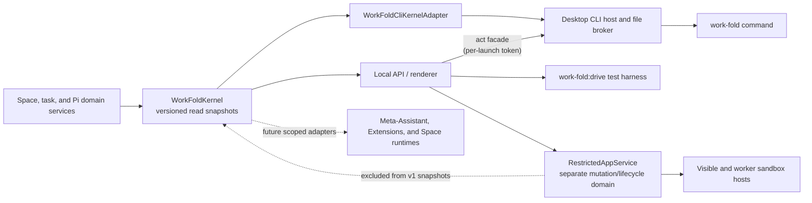

# work-fold management layer

> Request lifecycle consolidation: the [collaboration contract](collaboration-contract.md#completion-delivery-and-recovery)
> governs completion across turns. Questions use `chat ask|answer` or `manage
> ask|answer`; an accepted answer remains outstanding until linked. The fold,
> Space and app owners receive bounded, recorded child-result deliveries.
> App status/stop/usage follow the owned request, and task result reads expose
> its selected envelope. Counts and transport sizes shown in Limits are fixed
> in this build; the continuation switch is configurable.


The development desktop also exposes the authenticated renderer-only
`GET /api/management/control-events` SSE endpoint. Its closed `reset`, `apps`,
and `spaces` hints contain no content or authority and are not remote act
verbs. Visible renderers share one connection and re-read the relevant service
after a hint; reconnect sends reset without replay. The host caps connections,
sends heartbeats, and disconnects backpressured clients instead of queuing
unbounded updates. This keeps CLI-created Spaces and installed-app catalogs
current in the existing UI; it is not a file watcher or workflow event bus.

App act commands accepting `--app` resolve a unique manifest id or an exact
`featureInstallationId`. Ambiguous names refuse and list exact choices. The
resolved installation and digest travel through the existing domain controls,
including grant and automation execution; remove/reinstall cannot redirect
an admitted operation to identical replacement bytes. This is an act-lane
selector extension, not a protocol-v1 inventory or authority change.

work-fold now has a small management layer over its existing product model. It gives the renderer, command line, test harnesses, and future Assistant-facing adapters one semantic view of Spaces, running work, and Pi capabilities without creating another data store or agent framework.

This is infrastructure, not another navigation item. **work-fold**, **Space**, **Files**, **Chats**, **Library**, **History**, and **Assistant tools** remain the user-facing nouns. The management layer makes their underlying state inspectable in a consistent, versioned form.

The development extension UI adapter treats the fold as its own valid scope.
`GET /api/management/conversations/:id/extension-ui` and its Space equivalent
return current live Pi questions; `POST .../extension-ui/:requestId` validates
one response for that exact Chat. Chat SSE sends `extension_ui_snapshot` on
connection and change without putting prompts or answers in its replay log.
Remote summary advertises `capabilities.extensionUi` and includes only the
originating browser's non-secret questions. `management.extensionAnswer`
requires that request's exact active task, question id and browser grant,
rechecking revocation before callback delivery. It cannot answer another
surface's work or a setup-secret prompt. These session-local callbacks are
not durable request questions and never dispatch a continuation turn; see
[Assistant capabilities](assistant-capabilities.md#live-extension-questions-development).

## Why it exists

The desktop UI already knows how to work with Spaces and Pi, but a higher-level Assistant, an Extension, a script, or a future Space runtime also needs answers to basic questions:

- Which Space applies to this actor and working directory?
- Which Spaces are registered?
- Which Assistant turns or Chat compactions are still running?
- Which Skills, Extensions, tools, packages, prompts, themes, and commands are available in this Space, and what are their scope, source, trust, and load states?

Those answers should not be reimplemented by every consumer. `WorkFoldKernel` is the shared in-process read authority that produces them.



Domain services still own writes. The kernel does not bypass folder grants, registered-Space authorization, capability-mutation locks, History behavior, or any other mutation policy.

The desktop's early-created Check service shares the interactive API's bounded,
serialized fold-model reviewer through an in-process callback. This transport
is resolved only for an authorized Check run; it adds no read-protocol, HTTP,
act-lane, or remote verb.

The dotted restricted-app edge is a boundary, not a data flow into the kernel. Space apps have their own reviewed package, grant, encrypted connection, storage, named-automation, notification, and sandbox-host state. Protocol v1 and `work-fold.capabilities` intentionally do not list or mutate that state. The machine-wide automation scheduler is an in-process execution coordinator for that domain, not a management-protocol mutation surface. Future app inventory belongs in a deliberately versioned kernel snapshot only after its content and authorization contract are designed.

## Kernel contract

`src/local/work-fold-kernel.ts` defines `workFoldKernelSnapshotVersion` and a normalized actor context:

```ts
interface WorkFoldActor {
  kind: "human" | "assistant" | "cli" | "renderer" | "extension" | "app" | "system";
  cwd?: string;
  spaceId?: string;
  conversationId?: string;
}
```

Space resolution is deterministic:

1. An explicit `spaceId` wins.
2. Otherwise, the most-specific registered Space whose root contains `cwd` wins. This matters when registered Space roots are nested.
3. Otherwise, the result has no Space context.

The current snapshot version is `1` and exposes four read models:

| Snapshot | What it contains |
|---|---|
| `work-fold.context` | Normalized actor, resolution method, and resolved Space or `null`. |
| `work-fold.spaces` | Registered Space identities, roots, ownership/location metadata, and timestamps. |
| `work-fold.tasks` | Running `assistant_turn` and `compaction` records, optionally scoped to one Space. |
| `work-fold.capabilities` | Pi's authoritative capability catalog plus packages, project authorization, mutation eligibility, provenance, and diagnostics for one Space. |

The local API and the desktop CLI share one kernel instance. Assistant turns and Chat compactions register a task when work is accepted and finish it in success and failure cleanup paths. Capability mutations remain blocked while affected work is active, so a catalog reload cannot silently terminate a background turn.

Capability snapshots are projections of Pi's native catalog. They do not create a second full-trust registry, activate inactive tools, bypass the Space registry, or install anything.

This contract belongs only to work-fold's new profile and `.work-fold/` data. The kernel and its adapters never parse or project a legacy Workspace registry or `.workspace/` manifest. Registering a folder that contains preserved `.workspace/` data creates a new work-fold Space identity instead of adopting the old one.

## work-fold CLI

The Windows installer places `work-fold.cmd`, an extensionless `work-fold` shim, and the private `work-fold-cli.ps1` helper in `<install>\bin`, then adds that directory to the current user's `PATH`. The Mac bundle places the extensionless shim and `work-fold-cli.jxa.js` under `work-fold.app/Contents/bin`; work-fold adds that directory to child-process `PATH` for Pi shell tools without editing a person's Terminal profile.

```powershell
work-fold context --json
work-fold spaces list
work-fold tasks list --space "Personal Space"
work-fold capabilities list --space "Personal Space" --json
work-fold version
work-fold help capabilities
```

`--space <id-or-exact-name>` selects a Space explicitly. Without it, Space-aware read commands resolve the terminal's current working directory. Duplicate exact names are rejected as ambiguous; use the stable Space id in automation. `--json` emits the stable protocol projection and is the preferred interface for scripts, Codex, Claude Code, and other shell-capable harnesses.

The read commands stay content-free: Space names and paths, task metadata, and capability metadata — no file contents, conversation text, credentials, or provider tokens.

The same command also carries the **act lane** — the separately versioned, per-launch-authenticated surface through which a shell-capable agent can operate the product while the work-fold app is running:

```powershell
work-fold chat create --space "Home"
work-fold chat send --space "Home" --new --message "File the material I dropped."
work-fold chat send --space "Home" --conversation <id> --message-file notes.md
work-fold chat status --space "Home" --task <task-id> --json
work-fold chat wait --space "Home" --task <task-id> --timeout 900 --json
work-fold chat result --space "Home" --conversation <id> --messages 5 --json
work-fold chat abort --space "Home" --conversation <id>
work-fold chats list --space "Home" --json
work-fold spaces create --name "Vendor Audits"
work-fold spaces register --path /Users/me/Projects/existing-folder
work-fold files add --space "Vendor Audits" --from ./report.pdf --to "Inbox" --json
work-fold manage send --message "File everything I dropped into the right Spaces."
work-fold manage send --message "Put this where it belongs and start a review." --attach ./report.pdf --attach https://example.com/owner/project
work-fold manage wait --task <task-id> --json
work-fold manage status --task <task-id> --json
work-fold manage stop --task <task-id> --json
work-fold chat report --space "Home" --task <own-task-id> --summary "Filed three invoices." --file "Invoices/2026-09.pdf" --json
work-fold chat ask --space "Home" --task <own-task-id> --question "Which quarter?" --to parent --json
work-fold chat answer --space "Home" --question <question-id> --answer "Q3." --json
work-fold chat handoff --space "Home" --task <own-task-id> --to-space "Vendor Audits" --message "Review the filed invoices." --file "Invoices/2026-09.pdf" --json
work-fold requests list --json
work-fold requests show --request <request-id> --json
work-fold trash list --json
work-fold trash restore --entry <recently-deleted-id> --json
```

The four collaboration verbs ([the collaboration contract](collaboration-contract.md),
F27) are Space-scoped, receipted, and host-delivered: `chat report` attaches
one result envelope to the caller's own running turn, `chat ask` records a
question and puts that task's request in `waiting` without suspending the
turn, `chat answer` records exactly one answer and starts exactly one linked
continuation turn in the same Chat (the turn store dedups it under
`answer-<question-id>`, so a replayed answer returns the same turn), and
`chat handoff` copies the named files into the destination through the same
additive, restore-pointed path as `files add` and then starts a new Chat
there as a child of the caller's request. `requests list|show` are
management-scope reads of the request graph, and `chat wait`/`manage wait`
settle on a terminal turn **or** on a task that is waiting, saying which; the
status documents carry `waiting` and the request ref beside the turn state.
The records, refusals, waiting semantics, continuation rule, and limits are
specified under
[Durable requests, questions, and continuation](#durable-requests-questions-and-continuation).

`work-fold trash …` reads and restores **Recently deleted**, the machine-local
store under the state root that holds what a delete could not leave to History:
files and folders the safety restore point could not keep a copy of, deleted
managed Space folders, and app data that was cleared or purged
([Receipts, not gates](receipts-not-gates.md), F20). Like `routings` and
`pages` it sits above Spaces, so neither verb takes `--space`; each item names
the Space it came from. `trash list` is content-free — ids, kinds, paths,
sizes, and dates. `trash restore` puts one item back where it came from,
renaming it when something else took the name, and app data whose app is gone
is saved as a file with `--to <absolute-path>`. Nothing empties the store: the
retention window in Settings → The fold → Recently deleted does, and a tree
holding legacy `.workspace/` records is never erased.

`work-fold manage …` talks to the **management conversation** — user-facing name: **the fold** — the one conversation above all Spaces. It reuses the same acceptance path, Pi runtime, kernel task records, and task-scoped outcome semantics as Space Chats under the dedicated scope id `work-fold-management` instead of a Space id. Its transcript lives in machine-local application state under the app profile's `management/` root — it describes this machine's registry, so it is deliberately not portable Space data. Its Pi session loads personal-scope Skills and Extensions plus exactly two app-materialized project resources — a management `AGENTS.md` context file and the `manage-spaces` Skill, rewritten on every start — and gets no user Space's `.pi` configuration, no restricted-app bridges, and no History checkpoints (History is a Space concept).

Those two app-owned resources are required, not an optional enhancement. If work-fold cannot materialize them safely, ordinary Spaces and the desktop may still start, but management commands fail closed until the management folder can be prepared; work-fold never runs this full-trust scope as an unidentified, uninstructed Assistant.

Be precise about its authority: the management conversation is a **full-trust Assistant, taught rather than caged**. Like every work-fold Assistant it keeps Pi's ordinary read/bash/edit/write tools, which accept absolute paths anywhere this user can reach. The materialized instructions teach it to prefer the `work-fold` read and act commands for anything that touches Spaces — those carry the trust grants, restore points, receipts, and conflict rules — but that preference is instruction, not an enforced authority boundary. An enforced CLI-only management agent would be a different, deliberate design (per-session tool restriction) that this personal, local product has not adopted.

Without `--conversation`, manage commands target the most recent active management conversation, `manage send` creates it on first use, and `--new` deliberately allows additional threads while the default stays a single conversation; management turns appear in `work-fold tasks list` under the management scope id. The menu-bar and remote browser surfaces expose the same choice as **New chat**: the view becomes a clean slate immediately, the first send creates the new machine-local transcript, and the previous transcript remains saved rather than being cleared or rewritten.

### Management attachments, request lineage, and the popover surface

`manage send --attach <path-or-link>` (repeatable, at most 16) attaches **references, not copies**: absolute or cwd-relative file and folder paths, or http(s) links. A Space Chat stages dropped material inside the Space because Space transcripts are portable; the management transcript is deliberately machine-local, so its attachments carry absolute paths, missing sources are refused at send time, and the only copy in the flow stays the restore-pointed `files add` into a destination Space. Readable files inline into the turn within the shared context budget; folders, binaries, and oversized files stay honest path-only references; links arrive as a typed list, never as fake files. The typed references persist on the management user message, and `--attach` rides in ordinary act argv — the act protocol's envelope and payload shapes are unchanged.

Every accepted management turn is a **request**. Its hidden turn context supplies that request's task id, and the app-owned instructions require `--parent-task <id>` on `chat.send`, `files.add`, `spaces.create`, and `spaces.register`. The act host validates that explicit parent while it is active before journaling or running the mutation; attributed actions become the request's action trail, delegated turns become its children, and act receipts gain the same `parentTaskId`. An unrelated same-user CLI action is therefore never credited merely because one management turn happens to be running, and concurrent management turns remain unambiguous. This is lineage, not a new caller-authentication boundary: the act token still has the documented same-user posture. Every accepted turn — management, Space, CLI, routing hop, or app-requested — belongs to one **durable request record** under the state root's `requests/` directory (docs/collaboration-contract.md, F25): a management turn creates a root, `chat send --parent-task` creates a child under it, a Space turn with no parent is its own root, and a person's reply to a request waiting on their answer joins that request as a further turn rather than opening a second record. The record carries the assignment text, attachment references, the attributed action trail, child request ids, questions and results by id, rolled-up usage, and a state from the vocabulary `working`, `waiting`, `handed_off`, `done`, `partial`, `failed`, `stopped`, `expired`. Records survive restart: after the turn journal repairs itself at startup, every request still believed live is reconciled against it — settled, never re-dispatched — and stamped as recovered so nothing continues it. Settled request graphs are kept for 30 days. Transcripts and act receipts remain the long-lived content records, while the bounded machine-local turn journal preserves acceptance identity, stream checkpoints, and recent terminal outcomes.

`manage status --task` therefore reports a `request` object alongside the turn: per-attachment **dispositions** computed from recorded actions (`placed`, `registered`, or honestly `unrecorded`), recorded actions with restore-point ids, child turns with their own task states, the reply, and a **phase** — `working`, `needs_you` (an open question, or a reply whose final line asks one), `handed_off` (the management turn finished but a delegated Space turn still runs), `done`, `failed`, or `stopped`. The durable record's own `state` travels beside the phase (`partial` reads as `done` there and `expired` as `stopped`), with the request id, root id, kind, deadline, and bounded question and result references. Done requires both the management turn and every child to succeed; a failed or lost child fails the request, and an aborted child or accepted request-level stop stays stopped. A popover reply to `needs_you` joins the same request as a further turn — one record, one story — carrying the prior attachments and action trail without replaying those attachments into model context, and it is recorded as the answer to any open question that was waiting on the person. `manage stop --task` aborts the management turn and every turn still running anywhere under that request, withdraws its open questions, and names each turn it touched.

The same request model backs the desktop's **menu-bar popover** (macOS menu-bar item; the Windows tray gains the same "Your fold" entry), which talks to `/api/management/*` local-API routes — send with attachments, summary, request status, request stop, transcript, per-conversation runtime and thinking-level changes, and the event stream — through the same acceptance path, conflict rules, and kernel task records as every other surface. The popover is deliberately a window, not a tab, so the Space-bound tab contract is untouched. Its transcript stays visible as a conventional compact chat: person messages are colored bubbles aligned right, Assistant replies are unboxed and aligned left, and redundant speaker labels and divider lines are absent. It follows streamed text while pinned near the bottom but respects deliberate scrollback. **Open app** plus **New chat** are direct header actions. The per-conversation stream renders replay-safe `turn_snapshot`, incremental `assistant_delta`, and final `assistant_message` text in place; when the request settles, the persisted transcript replaces that transient projection. The composer's model label uses one fixed bridge to show the main window's Assistant settings scoped to **The fold**; the adjacent text-only reasoning selector is hydrated from the fold's selected model before the first send, saves Pi's default for a future session, and writes the live Pi session once the conversation has one. The aligned action becomes **Stop** while the request is active, using the existing request-scoped stop route, while the text area remains available for drafting; one compact live line carries the current activity without displacing the transcript. Dropping onto the macOS menu-bar icon stages bounded references, while dragging over the popover temporarily turns the whole surface into the drop target; neither sends anything, and send is always an explicit act. Its sandboxed renderer has a dedicated preload exposing only the local API session, dropped-file path resolution, hide/show-main, open-fold-model-settings, and window-material actions — it does not inherit the main renderer's folder, restricted-app, update, general settings, or shell bridges.

The fold has one machine-local provider/model preference distinct from every Space preference. Settings → Assistant labels that scope **The fold**; the same choice governs this one management conversation in the menu-bar/tray popover and paired web client. Each registered Space may additionally keep bounded machine-local **Space instructions**, keyed by its portable identity and appended to subsequent Pi turns without changing portable `.work-fold/` or `.pi/` content. Provider credentials remain machine-wide Pi AuthStorage records rather than being duplicated per scope.

### Durable requests, questions, and continuation

[The collaboration contract](collaboration-contract.md) (F25–F29) makes the
request an owned record rather than a projection. Every accepted turn —
management, Space, CLI, routing hop, or app-requested — joins one. A
management turn creates a root; `chat send --parent-task` creates a child
under that root; a Space turn with no parent is its own root; a person's reply
to a request that is waiting on their answer joins the existing record. Records
live under the state root's `requests/` directory, survive restart, and are
never replayed.

A **request** carries its id, kind (`management`, `space`, `app`, `routing`,
`cli`), root id, parent task id, owner scope (management, or a Space id plus
conversation id), app installation where one applies, initiating surface,
created-at, state, its turns, child request ids, question ids, results,
rolled-up usage, and a deadline. Its state comes from one vocabulary:
`working`, `waiting`, `handed_off`, `done`, `partial`, `failed`, `stopped`,
`expired`. A **question** carries its id, request id, task id, respondent
(`person` or `parent`), text, asked-at, state (`open`, `answered`, `expired`,
`cancelled`), the answer and answered-at, and the continuation task id. A
**result** is the F29 envelope — `summary`, optional `data`, optional `files`
as Space-relative paths with a fingerprint and size, and an `outcome` of
`succeeded`, `partial`, or `failed` — plus its task id, recorded-at, and
receipt id.

`requests list` and `requests show --request <id>` are management-scope act
reads of that graph. Like `trash`, `routings`, and `pages` they sit above
Spaces and refuse `--space`; each record names the Space it belongs to.

The four collaboration verbs are refusals, not gates. A `--task` must name the
caller's own turn. `chat ask --to parent` on a root with no parent is
delivered to the person, and `--to person` is the default; the asking turn
ends rather than suspending, and its request reads `waiting`. `chat answer`
delivers exactly one answer and starts exactly one linked continuation turn in
the same Chat; a second answer, an expired question, a stopped request, an
answer from a Space that does not own the question, and a Chat that is busy
are each refused by name. `chat handoff` copies the named files through the
same additive, restore-pointed path as `files add`, starts the destination
Chat through the ordinary acceptance path, and links it as a child of the
caller's root so its report flows back there. Delivery is host-side
throughout: no fold model turn is needed to move a report, an answer, or a
handoff.

Waiting is a host state (F28). `chat wait` and `manage wait` settle when the
followed turn reaches a terminal state **or** when its task is waiting on an
answer, and say which; a waiting settle exits 0 and prints the status document
with its `waiting` field, because waiting is not a failure. A parent turn
never blocks on a child that is waiting for input: it finishes and reports the
request as `waiting`. When every child of an owning request has
settled when the owning Chat is idle and selected child results have not been delivered, the host composes one deterministic
follow-up turn in that conversation — a `system`-actor turn joined to the root,
naming each settled child, its outcome, the files it chose, and any question
still open beneath it. It is counted against the per-root bound; past that
bound a settle is recorded rather than narrated. Continuations never follow a
root Stop, a request that ran out of time or hit a bound, or a restart, and a
person can turn them off in Settings → The fold → Limits.

Only the assignment text, the answer text, released report summaries, and
copied files ever enter a Space Chat. The request graph itself, other Spaces'
results, and the fold's transcript stay above Spaces.

The bounds are generous defaults in Settings → The fold → Limits
(`src/shared/fold-limits.ts`), and every refusal names the number it hit:

| Limit | Default | On hit |
|---|---|---|
| Request deadline | 24 hours | request `expired`; open questions expire; no continuation |
| Child tasks per root request | 32 | `chat send`/`chat handoff` refused, names this limit |
| Delegation depth | 4 | same |
| Concurrent children per root | 8 | same |
| Continuation turns per root | 4 | further settles are recorded, not narrated |
| Provider budget per root | unlimited (a host may set a cap) | request `failed`, names the cap |
| Question lifetime | the request deadline | question `expired` |

Envelope bounds travel with the same machinery: a summary of at most 32 KiB,
structured details of at most 256 KiB validated against the declared schema
when there is one, at most 32 named files, and question and answer text of at
most 16 KiB each. Settled request graphs are kept for 30 days.

### Work presentation for trusted surfaces

`src/shared/request-presentation.ts` defines the version-1 work view. It projects
one request and its linked descendants into labels, available actions, exact
person questions, and selected results with Space-owned file references. It
contains no sibling transcripts or general request-graph access. Questions are
shown four at a time, with the remaining count; answering reveals the next ones.

The authenticated local API reads it through
`GET /api/spaces/:spaceId/conversations/:conversationId/work`,
`GET /api/management/conversations/:conversationId/work`, and
`GET /api/tasks/:taskId/work`. The original task id keeps Apps pinned to their own
request even if the Chat later starts unrelated work. Journaled
`POST /api/requests/:requestId/answer|stop|continue` uses the shared answer, Stop,
and turn-admission paths. Answers carry `questionId` and `answer`; explicit
continuations carry a stable `deliveryId`. A lost-response retry acknowledges
the accepted answer or turn rather than dispatching another one. A continuation
carries the selected child reports and records their delivery before prompting.

The remote equivalents are `management.work`, `management.answer`, and
`management.continue`, plus the existing `management.stop`. They accept a task id
and require the root management request's original browser and grant. A child
inherits that root's ownership; unrelated Space requests do not. Summary
capabilities advertise `work: true`; older hosts keep the existing presentation.
The glance advertises whether an item can open these controls for that grant.

See [Collaboration experience](collaboration-experience.md) for rendering,
recovery, keyboard, and privacy behavior. These endpoints are for trusted
surfaces; restricted app bridges and published viewers receive no new access.

### Remote browser surface

Server-enabled private-alpha Remote access adds a browser surface to the canonical management
conversation; it does not add another Assistant, transcript, Pi session, or Space-chat mode. The
desktop renderer configures a unique address and password in Settings. A
server-side switch controls whether new addresses may be created; the public
desktop app carries no shared enrollment credential, and the bridge applies
per-IP and global enrollment rate limits. A
successful password check creates only a host-only, SameSite session. A new
browser then creates non-exportable P-256 signing and agreement keys plus a
fresh pairing id. The browser and desktop independently derive the matching
six-digit code from that id, the browser identity, and both public keys; a code
supplied by the relay is never authoritative. Confirming that code on the
desktop creates a desktop-signed, generation-bound browser grant. One browser, every browser, the
whole connection, and the address itself are separately revocable from the
desktop.

The public bridge terminates HTTPS and WebSockets and the hosted origin serves
the executable browser client. PostgreSQL durably stores the address and scrypt
verifier, device and browser public keys, grant certificates and generations,
hashed sessions, and bounded operation metadata. It does not store private keys.
Browser requests and desktop results use signed ECDH/HKDF/AES-GCM envelopes;
completed prompt, transcript, result, Space-name, and file-tree bodies are not
written to the database. This application encryption protects passive handling
and persisted relay state, not an actively compromised hosted origin: same-origin
code can use a paired non-exportable browser key, so the hosted client and
bridge are trusted authority in this alpha even though the desktop remains the
local execution endpoint. Live bounded encrypted response buffers, browser
event streams, desktop presence, and rate limits are process-local, so the
service must stay at one replica until those functions move to a shared
backplane. Scheduled cleanup, active-row expiry predicates, per-grant operation
caps, SSE caps, per-client queued-byte limits, and a global ciphertext-byte
budget bound the current process. Device protocol errors have a finite
per-connection budget and are terminal when received, while unknown typed
frames are ignored for forward compatibility. Structured aggregate metrics
cover request rate, password-check admission, device frame rate, event-loop
lag, connection counts, and the enrollment switch without recording ids,
content, ciphertext, tokens, addresses, or network identifiers.

The desktop does not expose its renderer token or tunnel arbitrary local HTTP.
`WorkFoldRemoteFacade` is a closed semantic adapter with bounded saved-Chat
listing, summary/transcript/rename/send/stop/watch operations for the management conversation,
management request projection, Space-name listing, and bounded Space-relative
tree projection, explicit file previews, and exact-installation read-only
[app views](fold-browser-apps.md). The browser-action foundation separately adds
`apps.actions.request|get|list|review|approve|cancel` over declared installed
worker actions; it requires a live host-only grant fence and journals exact
review/acceptance before dispatch. App frames do not receive review or approval.
The trusted parent owns Review, Run, Cancel and Stop; app code receives only
request/status/cancel. The adapter strips absolute roots and attachment target paths, applies
the ordinary ignore policy to tree views, rejects traversal and unknown fields,
and rechecks the locally encrypted grant immediately before execution.
Dispatch and desktop-local authority mutations share one serialization fence;
revocation removes local authority before contacting the bridge and stops
locally tracked management requests and their recorded delegated children.
Every local and bridge cleanup lane is attempted even if another fails, and
address removal keeps the device credential until server deletion is confirmed
or the server confirms that the account is already absent. Grant-scoped signed
request ids, atomic bridge delivery claims, desktop in-flight claims, and
exact-id recovery prevent a reconnect or bridge restart from inventing a second
prompt. A late signed result may complete an operation marked lost across a
socket replacement, and repeated increasing progress events remain valid.
`management.send` enters `acceptConversationTurn`, may explicitly
start a new saved thread, persist `remote_web` browser/grant provenance and a
signed request id, and participate in the same active-turn, stop, transcript, and Pi-session
rules as the desktop management surface. `management.rename` records the same
provenance on an append-only manual-title event, is retry-idempotent within that
exact browser grant, and refuses to race an active turn or Chat compaction. Each
accepted remote request records
both its browser identity and exact grant. Direct task-scoped request status and
stop calls reject every other browser or replacement grant, and cross-grant
summaries omit task ids and action details. That direct-adapter ownership check
is not hostile-browser isolation: every paired browser can prompt the same
full-trust management Assistant within the personal single-user trust boundary.
Space work is initiated only when that
Assistant uses the attributed act path; delegated children then use the target
Space's registered runtime authorization, native Pi project resources and tools,
and pre/post-turn History path. The Files selector is observational and never
changes the conversation target. Paired browsers can explicitly read bounded
text/image previews through capability-advertised `spaces.filePreview`, with
an exact Space id and relative path. Copied-file receipts and act receipts
provide direct navigation; previewing neither invokes a model nor publishes
content. See [file previews](fold-file-previews.md) for filtering, identity
rechecks, rendering, byte limits and revocation. The
stable kernel continues to classify it as a renderer surface; the durable
message/request provenance distinguishes remote acceptance without changing
the version-1 actor vocabulary. Current replay records require the exact
browser, grant, and signed request id. Shipped 0.2.2 records, which predate the
grant field, retain browser-and-request recovery compatibility. A bounded
filesystem-verified derived index accelerates this lookup without replacing the
append-only transcripts as authority; oversized stores fall back to the full
authoritative scan.

Remote file upload is bounded to six plain-named files, 6 MB each and 8 MB per
message, carried inside the encrypted request envelope. Uploads are temporary
management references under app-owned `management/Incoming/Remote/`: at most
64 MB is retained, request directories expire after 24 hours, revoking a browser
purges that browser's directory, and disabling Remote access purges the whole
incoming root. The management Assistant can use them there or place them into a
Space through the ordinary restore-pointed `files add` act. Remote results
expose names and sizes, never holding paths.

This is a powerful full-trust Assistant surface. Pairing authorizes a browser
to ask the taught-but-not-tool-restricted management Assistant to act with the
local user's authority while the desktop is online, including delegating to a
Space Assistant. Password possession alone is not that grant, and an offline
desktop cannot pair a browser or execute anything.

The closed remote operation vocabulary carries the fold's glance and watch surfaces: `management.glance`/`management.glanceSeen` return the deterministic digest and advance that grant's own last-seen marker — same signed envelopes, same effect-time grant recheck, no new persisted content classes at the bridge. `management.watch` streams one running management turn's bounded response text and current activity line as throttled `operation.event` ticks under the operation's own envelope identity; the durable transcript remains authoritative and replaces that transient projection when the turn settles. `decisions.list` and `decisions.decide` were removed on 2026-09-10 ([Receipts, not gates](receipts-not-gates.md), F19); the web client tolerates a desktop that no longer advertises them and renders Needs you as questions and due snoozes only. Paired browsers use the same verbs and receipts as the desktop; every receipt for a remote-originated act records the initiating browser and grant. Revoking a browser refuses in-flight remote operations and deletes its glance marker. Published viewer pages remain a separate plane.

Space-targeted act commands never resolve a Space from the working directory — every write names its Space explicitly. `trash list --json` and `trash restore --entry <id>` are Space-free act verbs over the machine-local trash; `apps list --space <id> --json` and `apps invoke --space <id> --app <id> --tool <name> --input <json>` let the fold see and call an installed app's declared tools with lineage and receipts. `spaces assistant show` is a content-bearing act read that returns the current default, only already-connected model choices, and instruction text; `spaces assistant model` saves the default for new Chats, while `spaces assistant instructions` changes subsequent turns. Both setters reserve the existing Space-scoped Assistant mutation fence across validation, write, and client invalidation, and their receipts contain model identifiers or an instruction character count, never instruction text. Provider credentials and connection setup have no act verb. `chat send` accepts a CLI-initiated Assistant turn through the exact same acceptance path as the renderer (conflict checks, stable request identity, durable acceptance before transcript append, kernel task record with a `cli` actor, portable transcript persistence, pre/post-turn History checkpoints) and returns a task id. The act-envelope request id is the turn's idempotency key, so an uncertain delivery cannot create a second Assistant run. Terminal failures and explicit stops append a typed, sanitized Assistant result before the task settles, including setup failures that occur before a provider can answer; that same durable rule covers the machine-local management transcript and menu-bar popover, while raw provider diagnostics stay host-side. That task id is how a caller follows exactly its own turn: work-fold keeps recent terminal outcomes (`succeeded`, `failed`, or `aborted`, with the persisted response message id or failure message) in a bounded machine-local journal across app restarts. `chat status --task`/`chat result --task` read it, and `chat wait --task` is a shim-side poll that finishes with that turn's own result — a failed or aborted turn exits non-zero instead of presenting an older transcript message as success (wait timeout exit code 7). On startup, an accepted turn that reached its transcript but never settled is recorded as interrupted and is not automatically rerun, because completed tools may already have changed something. `chat status|result --conversation` remain the transcript-scoped views. `files add` copies outside material in with a targeted restore point that succeeds or fails together with the placement, and `spaces create`/`spaces register` grant the same registered-Space runtime authorization as the desktop actions. Content-bearing chat and Assistant-preference reads (`chat status|result`, `chats list`, `spaces assistant show`) belong to the act lane too, so the read lane keeps its content-free property. When the interactive app is not running, act commands fail fast with "Open work-fold…" and exit code 6.

Optional Checks reuse this split instead of creating another management plane. `checks status` is the only read-lane Check command and emits aggregate counts/state only. Its experimental summary distinguishes enabled Checks that have `neverRun` from previously computed results whose inputs are `stale`; either keeps the Space-level state stale until a requested run establishes current evidence. `checks enable|disable|run|task|result|abort|problems|decide` use the act lane, require an explicit Space, and receive the same journal-first at-most-once receipts. `checks wait` is a shim-side task poll like Chat wait. Portable `.work-fold/checks/*.json` declarations are inert and registration never enables them; authority is an exact-digest machine record. Every run starts an internal kernel `check_run` task and participates in capability-mutation fencing, but the experimental task kind is deliberately filtered from stable `work-fold tasks` protocol v1 until its compatibility contract is promoted. Runs are explicitly requested or invoked by a separately enabled routing, bounded across all selected Checks, and receive a host-resolved closed input projection rather than ambient filesystem authority. Status computes freshness from runner-owned input identities and never executes sensor/provider logic. See [Checks](checks.md).

## Desktop handoff

The public command does not run Electron as Node; the `RunAsNode` fuse remains disabled. Instead it uses a bounded protocol-v1 file handoff:

1. The shim writes an atomic UUID-named request beneath the owning app's platform profile containing the arguments, current working directory, protocol version, and timestamp. An installed production app uses `%APPDATA%\work-fold\cli\requests` on Windows or `~/Library/Application Support/work-fold/cli/requests` on macOS. An uninstalled Windows package uses `%APPDATA%\work-fold Development\cli\requests`, and the separately identified Mac smoke app uses its own product directory. Packaged child commands receive that exact root through the CLI-only `WORKFOLD_CLI_STATE_DIR`; desktop state selection never reads it.
2. It starts or contacts the exact installed Windows executable or Mac app executable with that request id. Electron's single-instance handoff routes the request to the existing desktop host when the app is already open.
3. The desktop host claims and serializes the request, executes it through `WorkFoldCliKernelAdapter`, and atomically writes stdout, stderr, structured result, and exit code beneath `responses`.
4. The shim returns that output and removes its request and response files. The broker also removes stale bounded files during initialization.

A CLI-only launch can initialize the host, process its queue, flush Pi state, and exit without showing the interactive window. If the GUI is already running, the command uses the same kernel and live task registry as the renderer.

The broker rejects unsafe roots, symbolic-link or non-regular request files, path escapes, oversized payloads, stale timestamps, future clock skew, duplicate claims, and unsupported fields. These checks make the handoff bounded; they do not authenticate the caller.

## Security boundary

The platform CLI directory is a same-operating-system-user coordination channel, not a public API or authenticated caller boundary. Another process running as the same user may be able to submit requests and read the resulting local metadata. Protocol v1 therefore remains read-only; mutations are never added to it.

The act lane is the separately versioned write surface (`src/local/cli/act-protocol.ts`, protocol version 3) that satisfies the requirements a write surface was always going to need — in the smallest form that is honest for a personal, local product:

- **Per-launch request authentication.** The interactive app mints a random act token every run, writes it to `cli/act-token.json` (0600 on POSIX; Windows relies on the profile directory's ACLs), and removes it on shutdown. Shims attach the token to each act request; the desktop host compares it in constant time. On a single-account machine the OS user is the principal — the token binds requests to *this app run* and keeps stale or crash-residue requests inert; it does not pretend to distinguish same-user callers.
- **Freshness and at-most-once execution.** Act requests reuse the broker's bounded, atomic, freshness-checked claim path; a pending request id returns its recorded response, and after the shim cleans those files up, the journal's `accepted` records refuse a duplicated id outright instead of re-executing the mutation. The broker refuses requests older than its freshness window, and journal rotation holds entries at least that long, so the two windows compose into a durable at-most-once guarantee.
- **Explicit scope.** Every act command names its Space; there is no working-directory resolution for writes. Chat commands additionally name their conversation or task.
- **Journal-first receipts.** Every authorized act command appends an `accepted` line to `cli/receipts/act.jsonl` **before** its mutation runs — an unwritable journal refuses the command — and a terminal `ok`/`error` line after. Receipts record the initiating surface (`cli`, `popover`, `main-window`, `remote_web`), the initiating browser/grant for remote-originated acts, and typed undo references including Recently-deleted entry ids — identifiers and digests only, never content. The act protocol version advanced to 3 on 2026-09-10 (`src/local/cli/act-protocol.ts`); older receipts stay readable, including the retired decision and policy fields. A crash can separate the pair, but an applied action can never be missing its `accepted` trace; a missing terminal record is itself the honest signal that the outcome was interrupted.
- **Existing domain checks.** Act execution happens through an in-process facade the interactive local API exposes on its handle, reusing the same route internals as the renderer — registered-Space trust grants, capability-mutation locks, turn-conflict rejection, History checkpoints, and kernel task records included. Without the running interactive app there is no facade and nothing mutates.
- **Prepared acts.** Runnable-code, standing-power, and destruction acts still prepare a fully pinned record, recheck every pin at effect time, consume it journal-first, and execute at most once through a fenced kernel task — and they do so immediately on the call that asks. There is no pending state, no card, no expiry, no denial, and no authority mode; failed and interrupted executions are never auto-retried; destruction is reversible through History or the trash. The act and remote facades expose no secret entry, pairing, or enrollment.

Chat-scoped authorization (a token that may only touch one Chat), confirmation ceremonies, and revocation of individual grants remain future work for any surface that outgrows the personal single-user boundary.

## Agent harness versus management CLI

The management CLI inspects the running product. `work-fold:drive` serves a different purpose: it runs one real Pi turn through the same local API, built-in tools, Skills, Extensions, persistence, and event stream as the desktop app.

```powershell
npm run work-fold:drive -- --space-root C:\path\to\space --prompt "Summarize the files in this Space"
npm run work-fold:drive -- --space-root C:\path\to\space --prompt "..." --json --agent-dir C:\temp\isolated-pi
npm run work-fold:drive -- --space-id <id> --attach http://127.0.0.1:4327 --prompt "..."
```

Useful options include `--prompt-file`, repeatable `--context`, `--conversation`, `--attach`, `--agent-dir`, `--timeout`, `--json`, and `--quiet`. In-process runs use temporary work-fold application state unless `WORKFOLD_STATE_DIR` is set. Provider credentials still come from Pi auth storage or standard provider environment variables.

Use the CLI to assert management snapshots. Use `work-fold:drive` to test actual Assistant behavior end to end.

`work-fold:appearance` is a third, deliberately inert development primitive. It creates and validates
a bounded Space-appearance proposal that Codex or Claude Code can hand to a person for import in the
frontend. It does not contact the running product or mutate state, so it is not a protocol-v1 command
and does not weaken the authenticated-mutation requirements below. See
[Space customization](space-customization.md).

## Direction, not shipped authority

This read-only layer is the first primitive for a broader work-fold operating layer. It can support a future cross-Space Assistant and controlled Space runtimes because they can start from one semantic inventory instead of scraping UI state.

The renderer capability catalog now also carries validated declarative surface metadata from Extensions Pi actually loaded. The compact installed CLI projection remains content-free and does not emit surface block contents or mutate UI state.

Separately, the local restricted-app service can inspect and install completed reviewed web assets without evaluation, and the desktop can mount or invoke them through the sandbox hosts. Package dependency metadata is never resolved or installed. Restricted apps remain outside the kernel and CLI projection and must never be merged into Pi's loaded Extension catalog. See [Restricted app runtime](restricted-app-runtime.md).

It does **not** yet provide:

- a headless act lane (act commands need the running interactive app; the turn runtime lives there);
- Chat-scoped or revocable per-grant authorization beyond the per-launch act token;
- a tool-restricted or independently permissioned cross-Space meta-Assistant beyond the current full-trust, taught management conversation;
- event subscriptions for all state changes;
- imperative APIs for full-trust Pi Extensions to dynamically create or mutate rail items, panes, or tabs beyond the static `surface.json` contribution contract (restricted Space apps already have their separate host-owned navigator and tab bridge);
- a verified registry that binds a Space-local service to a work-fold-launched process generation;
- host-owned remote subscriptions or arbitrary push adapters for restricted
  apps (static reviewed automation notifications are already supported);
- resource isolation comparable to a mobile operating system; the shipped Chromium hosts and brokers do not eliminate renderer exploits or CPU/memory denial-of-service risk.

Restricted apps already have an explicit package, permission, lifecycle, sandbox-host, connection, storage, file-grant, named-automation, run-receipt, and UI-surface model. The remaining features should extend those contracts and the kernel's read authority instead of reaching around either boundary.

## Implementation and verification map

App-requested Assistant tasks use the same `acceptConversationTurn`, kernel
task, History, cancellation and durable turn journal as a normal Space Chat.
A request is journaled and dispatched in one call with exact installation,
authority and input pins; the native bridge cannot read arbitrary Chats, and
the trusted Apps tab offers Details, Open Chat and Stop. See
[App-requested Assistant work](app-assistant-tasks.md).

| Area | Source | Primary tests |
|---|---|---|
| Versioned snapshots and context resolution | `src/local/work-fold-kernel.ts` | `tests/work-fold-kernel.test.ts` |
| Compact CLI projection | `src/local/work-fold-cli-adapter.ts` | `tests/work-fold-cli-adapter.test.ts` |
| Protocol, parsing, output, and exit codes | `src/local/cli/protocol.ts`, `src/local/cli/commands.ts` | `tests/work-fold-cli-protocol.test.ts` |
| Act request schema and envelope dispatch | `src/local/cli/act-protocol.ts` | `tests/work-fold-cli-act-protocol.test.ts` |
| Per-launch act token file | `src/local/cli/act-token.ts` | `tests/work-fold-cli-act-token.test.ts` |
| Act receipts | `src/local/cli/act-receipts.ts` | `tests/work-fold-cli-act-receipts.test.ts` |
| Act argv parsing and executor | `src/local/cli/act-commands.ts` | `tests/work-fold-cli-act-protocol.test.ts`, `tests/desktop-work-fold-cli-host.test.ts` |
| Act facade over route internals | `src/local/server.ts`, `src/local/cli/act-facade.ts` | `tests/work-fold-act-facade.test.ts` |
| Atomic bounded file broker | `src/local/cli/broker.ts` | `tests/work-fold-cli-broker.test.ts` |
| Electron single-instance host | `desktop/src/work-fold-cli-host.ts`, `desktop/src/main.ts` | `tests/desktop-work-fold-cli-host.test.ts` |
| Installer shims and PATH integration | `desktop/cli/`, `desktop/nsis/cli-path.nsh` | `tests/desktop-cli-packaging.test.ts` |
| Real Pi turn driver | `scripts/work-fold-drive.ts` | Exercised against the local API when provider credentials are available. |
| Restricted app review, grants, lifecycle, and storage | `src/local/agent/restricted-app-*.ts` | `tests/restricted-app-*.test.ts` |
| Machine-wide restricted-app automation scheduling | `src/local/agent/work-fold-automation-service.ts` | `tests/work-fold-automation-service.test.ts` plus restricted-app service/API tests |
| Prepared acts (prepare, pin, journal, execute) | `src/local/fold-prepared-acts.ts` | `tests/fold-prepared-acts.test.ts`, `tests/work-fold-cli-act-receipts.test.ts` |
| Recently deleted (trash store, retention, restore) | `src/local/trash-store.ts` | `tests/work-fold-trash-store.test.ts`, `tests/work-fold-cli-trash-verbs.test.ts`, `tests/trash-settings.test.ts` |
| Durable requests (records, store, reconciliation, retention) | `src/local/requests/request-records.ts`, `src/local/requests/request-store.ts` | `tests/work-fold-request-store.test.ts`, `tests/management-requests.test.ts`, `tests/work-fold-request-integration.test.ts` |
| Space turn context and operations guide | `src/local/agent/space-turn-context.ts`, `src/local/agent/space-operations-guide.ts` | `tests/space-turn-context.test.ts`, `tests/space-operations-guide-prompt.test.ts`, `tests/management-turn-context.test.ts` |
| Report, ask, answer, handoff, waiting, and continuation | `src/local/cli/act-commands.ts`, `src/local/cli/act-facade.ts`, `src/local/server.ts` | `tests/work-fold-collaboration-verbs.test.ts`, `tests/collaboration-result-envelope.test.ts`, `tests/work-fold-collaboration-journeys.test.ts` |
| App Assistant requests and bounded inference | `src/local/agent/restricted-app-tasks.ts`, `src/local/agent/restricted-app-inference.ts`, `src/local/agent/bounded-inference.ts` | `tests/restricted-app-tasks.test.ts`, `tests/restricted-app-inference.test.ts`, `tests/bounded-inference.test.ts` |
| Routing declarations, store, settle signals, and executor | `src/local/routings/` | `tests/work-fold-routing-declarations.test.ts`, `tests/work-fold-routing-store.test.ts`, `tests/work-fold-routing-settle-signal.test.ts`, `tests/work-fold-routing-service.test.ts` |
| Glance composition and seen markers | `src/local/glance.ts`, `src/local/glance-seen-store.ts` | `tests/work-fold-glance.test.ts`, `tests/work-fold-glance-seen-store.test.ts` |
| Publications and viewer serving | `src/local/publications.ts`, `desktop/src/remote-access.ts` | `tests/work-fold-publications.test.ts`, `tests/desktop-remote-access.test.ts` |
| Visible and worker sandbox hosts | `desktop/src/restricted-app-host.ts`, `desktop/src/restricted-app-preload.cts` | `npm run desktop:restricted-app:smoke` plus focused host/broker tests. |

See [Architecture](architecture.md) for the surrounding process boundaries, [Product model](product-model.md) for the user-facing mental model, and [Windows build](windows-build.md) for packaging and release verification.


### September 2026 contract expansion

Checks retain protocol-v1 content-free status and the authenticated act lane. Their experimental snapshot payload is now version 1; machine Check state is version 2 and reads version 1. The built-in `work-fold.text-review` sensor adds quoted text evidence and hashes every designated primary/reference input. Its bounded request uses the fold's model and never includes the management transcript. Opening status performs no provider request. Check runs serialize their native model requests machine-wide; the Space-app inference lane reuses the same transport under its own separate limiter. The desktop New Check form, enable/disable controls, and installed CLI use the same Check service; re-enabling existing definitions pins the reviewed declaration digest.

Routing declaration version 3 adds `files-changed` with an explicit folder, recursion, extensions, debounce, and cooldown. Versions 1 and 2 remain readable. Its bounded metadata observer carries no content into Chat: only the fixed, reviewed step message is dispatched. Trigger receipts retain snapshot digest/change count, and Settings reports observer health. Global pause/baseline behavior avoids routing feedback and deliberately does not replay changes while routing work runs or the app is asleep/quit. See [Routings](fold-routings.md).

Desktop and CLI History restores reserve affected Space work through completion and consult the same routing/app-automation blockers. Provider setup/removal uses the global capability fence, so changing a provider cannot silently stop accepted Chats or Checks. CI includes the hosted bridge's own test suite as well as root tests and desktop preparation.

### Receipts, not gates (2026-09-10)

[Receipts, not gates](receipts-not-gates.md) removed the authority gate from the act lane; the machinery underneath it stayed. The changes a caller can observe:

- The act protocol envelope advanced to version 3 (`src/local/cli/act-protocol.ts`). An older shim is refused with the typed version error rather than handed a differently shaped result. Receipts written at version 3 carry no `decisionId` or `policyId`, and the surface vocabulary shrank to `cli`, `popover`, `main-window`, and `remote_web`; readers still accept the retired `policy` and `unrestricted` surfaces on older lines.
- The remote operation vocabulary lost `decisions.list` and `decisions.decide`. A web client that still asks for them gets the ordinary unknown-operation refusal, and the shipped client no longer asks.
- New act verbs: `trash list|restore` over Recently deleted, `apps list|invoke` so the fold can see and call an installed app's declared tools, and `routings enable` in place of the old staging token. `files destroy` and the `staged list|show|cancel` family are gone.
- `assistant.request` journals and dispatches a Space Chat in one call with no review state, and `assistant.infer` performs a bounded, tool-free model call on the same transport the Check reviewer uses under its own limiter. Installation is the grant for both ([App-requested Assistant work](app-assistant-tasks.md)).
- Settings → The fold gained **Recently deleted**: the entry list, Restore, Save a copy, Delete now, and the retention window (default 30 days). The Authority selector and the standing-rules section are gone from every surface.

### Collaboration contract (2026-09-11)

[The collaboration contract](collaboration-contract.md) made requests durable
and gave Assistants a way to hand each other work. The changes a caller can
observe:

- New act verbs: `manage ask|answer` and `chat report`, `chat ask`, `chat answer`, and `chat handoff`,
  Space-scoped and receipted. They are available to the fold, a Space
  Assistant, an app-requested task, and an outside harness on the same terms;
  `work-fold help collaborate` documents them. `requests list|show` are the
  Space-free **management-scope** reads of the graph and are the exception:
  the graph carries every Space's results and the fold's own assignment text,
  so a caller whose directory resolves to a registered Space — a Space
  Assistant, or a harness working inside one — is refused by name. A Space
  follows its own work with `chat status`, `chat wait`, and `chat report`.
- `chat wait` and `manage wait` now settle on `waiting` as well as on a
  terminal state, exit 0, and name which happened. A shim that only broke out
  of `accepted`/`running` would sit on a question forever; the packaged Mac and
  Windows shims now stop polling and print that task's status instead.
- `chat status`/`manage status` documents carry a `waiting` field and a
  `request` reference beside the turn state. `manage status --task` keeps its
  phase projection (`working`, `needs_you`, `handed_off`, `done`, `failed`,
  `stopped`) and travels beside the record's own eight-value state, where
  `partial` reads as `done` and `expired` as `stopped`.
- The in-memory management request registry is gone. The same projection is
  now read from the durable request store, so a restart keeps the request graph
  the popover, the remote client, and the glance read.
- A settle batch beneath an owning request can start one host-composed
  follow-up turn in that conversation, bounded per root and switchable off in
  Settings → The fold → Limits. It follows only an explicit request; a declared routing fold step is the
  separate trigger-driven entry.
- Space turns receive their own hidden context — task id, request id, and, when
  delegated, an opaque parent handle and the assignment text — plus a compact
  operations guide appended to the system prompt the way Space instructions
  are. No registry, no other Space's results, and no fold transcript.
- Apps subscribe to their own work changing through `bridge.tasks.onChanged`,
  `bridge.checks.onChanged`, and `bridge.files.onChanged`, and a finished app
  Assistant task returns the same result envelope every other result uses.

## Fold-led Checks

Checks authoring uses the fold, with an unsent draft from the Space-owned Checks tab. `checks propose` and `checks propose-fix` are authenticated, receipted, explicitly Space-scoped inert proposal operations; neither enables a Check nor edits a target. Trials and human-reviewed corrections use the same Check service and reservations. The main-window glance links to the owning Space’s Checks tab. The fold popover stays focused on conversations and has no separate Checks disclosure. Findings prepare unsent help drafts in fresh Space Chats; no model turn starts merely because a finding appears. See [Checks](checks.md) for the exact review, History, freshness, and trial-isolation contract.

Check help drafts name their Space-scoped CLI operations. `help checks` documents
the full correction JSON, and `help routings` provides a validated complete
folder-change proposal. These are authoring aids; they add no authority or
new protocol fields and keep implementation details out of the Checks panel.

## Observed turn files and app result links

The additive optional `fileChanges` field in `work-fold.turn.v1` records full
pre/post History checkpoint ids and at most 64 changed/new file paths, hashes
and sizes. It contains no file bytes and is admitted only on terminal turns;
old records remain readable. Current management requests project at most 12
currently visible child-file paths and exact installed app references. Browser
ownership filtering removes both from another browser's aggregate summary.
No content-free read-lane contract changes. The request trail is durable under
the state root's `requests/` directory and bounded by the same per-request
limits and 30-day retention as the rest of the record; turn metadata alone
still does not reconstruct a request that retention has removed. See
[file previews](fold-file-previews.md) and
[browser apps](fold-browser-apps.md) for current-file and installation semantics.

The authenticated renderer can list saved fold Chats at `GET /api/management/conversations` and pin `GET /api/management/summary?conversationId=<id>` to a selected Chat. The transcript and latest request always come from that same id. The paired `management.chats` projection optionally includes `requestState` and `needsAnswer` for browser-owned requests; older clients and host operations remain compatible. This changes no CLI protocol or request authority.
